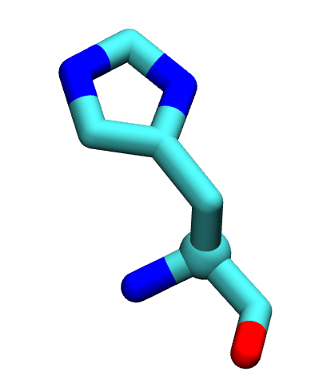
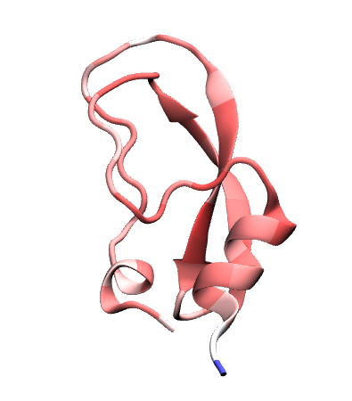

<script src="https://cdnjs.cloudflare.com/ajax/libs/mathjax/2.7.0/MathJax.js?config=TeX-AMS-MML_HTMLorMML" type="text/javascript"></script>


In this session we will build the setup, analyse the configuration file and
perform a small analysis of a system.[^1]

[^1]: This tutorial is based on [NAMD tutorial]() and [BPTI case study]()

### Getting ready
For this tutorial, download the following
#FIXME: add source [source file]().
You should know how to untar, but let's remind it:
<p class="prompt prompt-shell">$ tar xvzf tutorial2.tar.gz</p>

#FIXME: add folderlist
There should be two folders: `foo/` and `bar/`.

## Biological case study
What is BPTI? Historical and biological background.

McCammon 1977

## Overview
Let's recap the so called **MD machinery**.

#TODO: CHANGE IMAGE TO check if they remember the file


## Key concepts of simulation:

- TIME SCALE


Question to ask before running the simulation:
1. What process I want to investigate?
    - i.e. exchange of proton for the cleavage of bpti and trypsin (introduced in
      the BPTI overview): NO because of bond breaking.
2. Do I have enough resources? you hope so
3. What level of detail do I need?

We will keep these question in mind, but we will ignore them for now.

## PSF
Let's start from the pdb of the protein alone. Recap of PSF

create the psf with
Autopsf gen
#TODO: check the protonation state of LYS etc

move the protein in the middle

minmax of the protein.


## Overview of what algoritms we use for simulation


- velocity verlet:
  1. force from ff (non bonded?!?)
  2. time step: H vibration as period of 10 fs
  3. initialise velocity


- simulate the correct ensemble:
  1. thermostat (langevin-cenni: drag force and stochastic force) to fix NVT
  2. barostat to have NpT
  3. NVT again to reduce perturbation of the system.

## Implicit solvent
- psf with autopsf
#TODO: how long does the simulation take?

- create the configuration file:
    - time step
    - group
    - exclude 1-4

- output commands (computation of energies is expensive >100 ts)

- use the toppar file download

- analysis of the log file (part I:
One of the output of the simulation is the logfile.
Let's open it. There are a lot of information written in it, such as
the initialisation of the system, checking the number of atoms, the existence of the
files, the correctness of the parameters file, the recap of the setup defined
in the configuration file.

Let's open the logfile with _ViM_ and search the word `Benchmark`.

    - The information on the simulation
    - benchmark info (check the difference in benckmark when solvated with 1/2/3/4 cores for sims of 1000min+1000 running)

- check energy with namd plot
    - temperature
    - potential energy
    - these quantities equilibrate faster than the protein (#TODO: check). compare with rmsd

- initialisation of velocity uniform and/or MB

- printing out velocities for MB/specific heat.

#TODO: see namd tutorial

(while the simulation is running, go on)

## Solvation box

- create the psf of the system solvation + ionisation
why do we solvate/ionise the system

#TODO: how long does explicit sim take?

- PBC

- solvate with tkconsole

- ionise with GUI

- launch with more cores.(probably reduce cutoff to 9 to have a smaller box)

- error on the temperature/fluctuations

- initialisation of velocity uniform and/or MB

To launch `namd` using more cores you can use:
<p class="prompt prompt-shell">$ namd2 -pN conf.namd > lognameN.log &</p>
where `N` is the number of cores available.
Launch the same simulation using 1,2,3,4 processes (change also the logfile name).
In general you should be able to run with `4` cores,
but remember that your computer needs some resources for the
opetating system. Therefore, you may not see an increase in the performances
for 3 processes to 4.
<p class="prompt prompt-attention">
1) The output will be overwritten.<br>
2) If you want to do a for-loop modify the command above (hint:`&`)
</p>

---

# AWK detour
_AWK_ is a scripting language to manipulate text. It is particular useful for small
tasks that do not rqeuire a lot of lines of code.

The basic syntax of an _awk_ instruction is:
`awk '{some actions}' < input.file`.
_awk_ will loop over the lines of the file and perform the actions you wrote.
The default variables you will need are:
- `NF`: number of fields (i.e. columns separated as default by blank spaces);
- `NR`: number of rows (i.e. lines), the counter over which the default
 loop is performed;
- `$0`: a whole line;
- `$i`: the i-th field;
Moreover you can do operation at the before (`BEGIN`) and after (`END`)
 the main loop.
First, create a file with 1 column filled with numbers from 1 to 100.
**Hint**: use a bash for-loop.

Then, let's compute the sum and the average.
```bash
awk 'BEGIN{sum=0} {sum += $1} END{print "sum:", sum, "\navg:", sum}' < gauss_spicciame_casa.dat
```
See _Notes_ for more information and fancy things[^2].

[^2]: Rtfm on `man awk`, or use Google.

---

Now that we know a bit of _awk_, let's use it for our purposes.
First let's see how different numbers of cores affect the computation.
<p class="prompt prompt-shell">$ grep "Benchmark" logname1.log</p>

Let's see what is inside.

From these lines we can extract the information we need sending them as input
for _awk_ by using `|`.

<p class="prompt prompt-shell">$ grep "Benchmark" logname1.log |
 awk '{print $X, $Y, $Z}' > benchmark.dat</p

Of course we can do the same for all the 4 logfiles.
<p class="prompt prompt-question">When do you have the ""best"" perfomances?</p>


---
- awk for TIMING/BENCHMARK
- using different cores, extract info of Benchmark with `for i; do grep "" $i| awk`


- awk to extract info

- rmsd (should I put it at the beginning)

# BLACKBOX section
The idea is to group the commands that we don't want to explain into
a section called black box.
We can put here all the instructions not mandatory for the computation
that they will be explained in the next theoretical lessons, such as:
- neighbour List
- switching distance
- cutoff
- PME
- rigid bonds
- pressure coupling
- others?


## deeper analysis in the analysis tutorial
comparison of the results

<!--
## May the Force (field) be with you!

The idea is to solve the Newton's equations of motion for all the atoms in the
system. For each atom in 1D we can write:

$$m\frac{d^2 x}{dt^2} = -\nabla U$$

We need then to know what the potential $$U$$ is. The set of functions and parameters
that composes the $$U$$ is called **Force Field** (**ff** from now on).

The idea behind **ffs** is to mimic the experimental behaviour of proteins with a
potential for atoms that has a
feasible computational cost.
There are several force fields available, such as:
- CHARMm, AMBER for all-atom simulations;
- Martini for coarse grained simulations.

Each ff has its own functional form and its protocol to define parameters. The parameters, in fact, hide under the hood assumptions that make the functional formation viable for simulations. Mixing CHARMm parameters with the AMBER potential,
to mention two of the most popular ffs, will lead you to unreliable results.

<p class="prompt prompt-attention">Do not mix parameters from different force
fields!</p>

Moreover, ff parameters evolve as more data and simulations are gathered.

<p class="prompt prompt-attention">Check for the latest version of force fields!</p>
We will mainly use CHARMm ff (version 36).

In general, each force field has two main parts (we are omitting the dependence
  on the coordinates and parameters that will be clear in the following):
\$$ U_{ff} = U_{bonded} + U_{non~bonded} $$

Let's have a graphical representation.
<p align="center"> <b>Bonded interactions</b> </p>


<p align="center"> <b>Non-bonded interactions</b> </p>


As their name suggest, we can define interactions for covalently bonded atoms as:

$$
\begin{align*}
  U_{bonded} & = \sum_{bonds} \frac{1}{2}k_{bond} (r_{ij} - r_0)^2 \\
      & +  \sum_{angles} \frac{1}{2} k_{angle} (\theta_{ijk} - \theta_{0})^2 \\
   & + \sum_{dihedrals} k_{\phi,n} [\cos(n\phi_{ijkl} +\delta_n) +1]\\
   & + \sum_{impropers} k_{improper} (\chi_{i^{*}jkl} - \chi_0)^2
\end{align*}
$$

but we have also to take into account non-bonded interactions between molecules and
within molecules:

$$
\begin{align*}
  U_{non~bonded} & = \sum_{nb~pairs} \Big[ \frac{q_i q_j}{4\pi\epsilon_0 r_{ij}}
  + \Big(\frac{A_{ij}}{r_{ij}^{12}} - \frac{B_{ij}}{r_{ij}^6}\Big)\Big]\\
\end{align*}
$$

# Alanine dipeptide
Alanine dipeptide is a small peptide usually used to study protein backbone
 dynamics. It consists of an `ALA` in the middle equipped with two minimal peptide bonds. The N terminus _NH2_ gains an acetyl group _CH3CO_, while the the C terminus
 _COOH_ obtains a methylamide _CH3NH_.


<p align="center"> ACE - ALA - NME </p>

<p class="prompt prompt-question">How many carbon atoms are in the alanine dipeptide?<br>
Are C atoms bonded with the same kind of atoms each time they appear?</p>


A `pdb` and a `top` file for the alanine dipeptide is provided.
Let's inspect the content of these files.

<p class="prompt prompt-attention">Use Vim! :)</p>

In the same folder you have also a configuration file called `vacuum.namd`.
It is required to launch **NAMD** and perform the simulation. It is a `Tcl`
script were you can set the parameters of your simulation, the algorithms you want
to use, and the output.
Let's open it as well.

Let's run the simulation! It will take few minutes.
<p class="prompt prompt-shell">$ namd2 vacuum.namd > ala_vacuum.log &</p>

<p class="prompt prompt-question">What does > and & do?</p>

Try to use the `tail` command:
<p class="prompt prompt-shell">$ tail -f *.log </p>
Use `ctrl-s` to stop the shell screen if it is too fast. To resume the scroll,
use `ctrl-q`.

After the simulation is completed, load with the `Tk console` in _VMD_
the `pdb` and the trajectory.
<p class="prompt prompt-tk">% mol new dip.pdb<br>
% mol addfile file.dcd waitfor all</p>

Let's compute the dihedral angles $$\phi$$, whose definition is
$$C_{i-1}-N_{i}-C\alpha_{i}-C_{i}$$, and $$\psi$$, dihedral defined by
$$N_{i}-C\alpha_{i}-C_{i}-N_{i+1}$$.

**Hint**: you `measure`,`4`, _Extension_.

## Coordinates: PDB
We have already see a `pdb` file few moments ago.


Let's go the [Protein Data Bank website](https://www.rcsb.org/) and search for the
structure `4pti`.

Let's give a brief overview of these columns
- `serial`: integer associated to each atom;

- `name`: `atom name` of each atom (see figure below);

- `resname`: 3-letter code for protein, it can be a 4-letter code for fancy residues;

- `chain`: 1-letter identifier for each chain in a pdb;

- `x`, `y`, and  `z`: try to guess;

- `occupancy`: usually `1.00`, it can be less than 1 if the structure is not univocally resolved;

- `beta factor`: temperature $$\beta_i = \frac{8\pi^2}{3}~msf_i$$, it is related to the flexibility of the residue;

- `element`.

Regarding the atom names, they follow the _star_ convention:
from $$\alpha$$ (of the Carbon $$\alpha$$) to $$\beta, \gamma, \delta$$...

<p align="center"> Histidine, as a constellation.</p>
<p class="prompt prompt-attention">PDB files have a fixed format. Do not
modify them manually if you are unsure of the outcome!</p>

Move the `pdb` file from `~/Download/` into `QCB_course/bpti/`.

Let's open it (with ViM!). For sake of safety, use:
<p class="prompt prompt-shell">$ vim -R 4pti.pdb</p>

Let's search the keyword we already know. Type in the _Vim_ `Normal mode`:
`/ATOMS ` (note the white space after the `S`).

`ATOMS`, `HETATM` define the rows in which atoms are written. The first is used
for the atoms of the proteins, ligands and water atoms are defined by the latter.

Let go at the beginning of the file (`gg` in _ViM_).
There are a lot of information, most of the are experimental data.
They are characterised by the keywords in the first column.
Some of them will be explained in the next lessons.
Now, go to the first `SEQRES` (search within _ViM_).

Let's focus on the `SSBOND` keyword. In this section, if present, disulfide bonds
are defined.
These are bonds between the sulfur `S` atoms of two close cysteins.
Disulfide bonds play an important role in the folding and stability of some proteins,
therefore you have to include them in your future structure.

<p class="prompt prompt-question">Write down the resid of the disulfide bonds.</p>

Load the pdb with _VMD_, and remove the water from the visualisation.
Visualise in _Licorice_, if present, aspartic acids, glutammic acid, lysine and arginine.


Visualise the disulfide bridges.
<p class="prompt prompt-question">Does VMD create a link between 2 close sulfur atoms? Is it "real"?</p>

Visualise the protein using _Beta_ as _Coloring method_.

<p class="prompt prompt-question">Does the colour scheme fit with your intuition?</p>

Let's write a new pdb without the water,  since it will be useful for the `psf` file.


* with `awk`;

* within _VMD_:
<p class="prompt prompt-tk">% set prot [atomselect top "protein"]<br>
% prot writepdb only_bpti.pdb</p>

You should have (**not**) successfully create a new `pdb` file. Why?

**NB**: Usually the water molecules in a `pdb` can play an important role in the
protein biological function. In general, it is a good practice to keep them in
your final system.

## Topology: .psf and .top in CHARMm
Let's download the latest version of the [CHARMm ff](https://mackerell.umaryland.edu/charmm_ff.shtml)
and extract it into our `QCB_course/` folder.

From now on, we will use _topology_ for referring to the `top_*` files of the
force field, and _structure_ for the `psf` file.


<p align="center"> <b>Topology file</b>: a collection of bricks.
<b>PSF file</b>: a subset of the top file arranged in a particular fashion.</p>

The idea is to use the `top` file to construct the `psf` of our system.

First of all, let's _list_ all the file inside this folder.
As you can see, the topology files are divided into categories:
_prot_, _lipid_, _na_...

Open the `top_all36_prot.rtf` (again with _ViM_) in a read-only mode.

You will see a first part with the `MASS` definition, then the `RESI` keywords, and eventually the `PRES` keywords.

This `top` file is like a dictionary, with all the possible words (`RESI`) you can
use in your _sentence_ (i.e. *system*).

The `PRES` are the so-called *patches* and they allow us to modify some residue if
you have a different protonation state, want to combine two residues, add a terminus...

# PSF
The `PSF` file contains the information of your system structure and the charge
information.

Each segment of the system not covalently bound to others must have a separate
psf file. For a single-chain protein in solution is trivial. You have also to write
 different `psf` if your system consists of several units, i.e. a multimer.

To write a `psf` file, we will use _VMD_ with the _Tk console_.
You can write it as a script and load it in the tk console.

```tcl
# load the namespace we need
package require psfgen
# read the information from the topology file
topology _correct_path_to_what_top_file_to_use?
# build the protein segment with name BPTI
segment BPTI {
pdb _yours_.pdb
#autoregenerate angles and dihedrals by default, NTER CTER
}
# Write down the patches we need to apply (What patches?)
patch _Patchname_ _segmentName_:_resid_ _segmentName_:resid
patch _Patchname_ _segmentName_:_resid_ _segmentName_:resid
patch _Patchname_ _segmentName_:_resid_ _segmentName_:resid
# using alias due to different atom name in pdb vs charmmff  
pdbalias atom ILE CD1 CD
# readind the coordinates
coordpdb _yours_.pdb BPTI ;# write the segname!!!!!
# guess missing coordinates: are there missing atoms?
guesscoord
# write the structure and coordinate files
writepsf out.psf
writepdb out.pdb
```
If there are no errors, load first a _new_ molecule with the `psf` and then the
`pdb` file.

<p class="prompt prompt-question">Check the N-ter and C-ter with respect to the patches in the top file.</p>

You can also use _Extension -> Autopsf_ to generate the psf file, and most of the
things will run behind the scene. ;)

To check whether the psf is ok, we can also run a small minimisation.

NAMD used an improved version of the conjugate gradient.
The aim of the minimisation is two-fold:
1. to remove the steric clashes that can be present when building a system adding elements;
2. to _move_ your structure into the ideal one provided by the topology file, with equilibrium distances, angles...

To launch the minimisation, use the `minimise.namd` that have to be completed and launch it with:
<p class="prompt prompt-shell">$ namd2 minimise.namd > bpti_min.log&</p>
-->
# Further Notes
1. [NAMD Userguide]()
---
# Notes

#FIXME: fix notes
