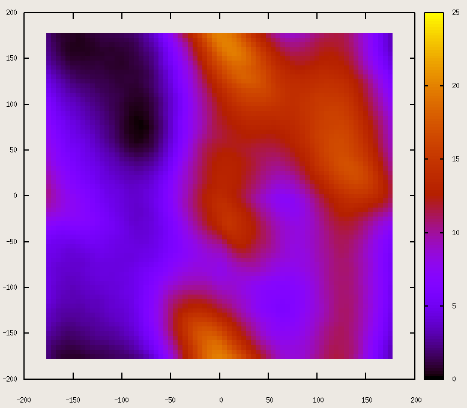

<script src="https://cdnjs.cloudflare.com/ajax/libs/mathjax/2.7.0/MathJax.js?config=TeX-AMS-MML_HTMLorMML" type="text/javascript"></script>

<!--
# Things necessary

<p align="center">
$$
\begin{align*}
V_b  & = \frac{1}{2} K_b (d_{ij}-d_b)^2\\
V_{id} & = K_{id} (\theta_{ijkl} - \theta_{id})\\
\end{align*}
$$
</p>

-->

File necessary for the tutorial available from
[here](https://drive.google.com/file/d/1wUbRA4DcF45X64JPOeyYoTy1lbCpG5s5/view?usp=sharing)

# GO HERE: https://tinyurl.com/QCBtut10


## Free Energy
Let's start from the definition:

<p align='center'>
$$ A = - k_{b} T \ln Q_{NVT}$$
</p>

Today we will talk only about the conformational free energy.

The free energy can tells us the stable states of our protein, if a conformation
is more stable than another one.

If we know the free energy landscape of a system, we can characterise
completely our problem.

<p class="prompt prompt-question"> How do we compute the Free Energy?</p>

We can perform a MD simulation and compute the histogram of the conformations
accessed in the trajectory by using:
<p align="center">
$$
A(\xi) = -kT \ln \int_{\Omega} dx~ \delta(x - \xi(x)) \exp(-\beta U(x))
$$
</p>

When we talk about free energy along cvs we usually refer to the potential of
mean force. 


We encounter a problem. The number of atoms in a biological system 
is enormous. So, in most cases makes it simply impossible for us
to understand anything by monitoring the atom positions directly.

Moreover, the processes we are interest in can be characterised using a small 
set of generalized coordinates: the collective variables. 


For example, we can characterise the conformations of the alanine dipeptide 
with the two dihedral angles: $$\phi$$ and $$\psi$$.



There are several minima.


<p class="prompt prompt-question"> Let's plot the same plot from our plain MD
simulation. </p>

It means:
1. extract the $$\phi$$ (from CY to C);
1. extract the $$\psi$$ (from NT to N);
1. plot the two time series; 
1. do the histogram

<!--
why does it suck?

No ergodicity of our trajectory: lim t-> oo, and we did only 5 ns.
possible solution:
1. buy Anton
1. Wait ages
1. use some tricks. -> Enhanced sampling


Infinte number of methods/approaches

Today we will see some of them.

-->

## Colvar
A collective variable is  a function of the Cartesian coordinates.

Let's have a look at the [NAMD Userguide](https://www.ks.uiuc.edu/Research/namd/2.12/ug.pdf)


So, a generic colvar can be defined as:

```
colvar {
    name         bubu
    width        0.1
<type-dependent definition>
    distance {
        group1 { atom selection}
        group2 { atom selection}
}
bias {
    colvars what_colvar_to_biased
    bias_option

```

and in order  the NAMD conf file.

```
colvars                 on
colvarsConfig           colvarsA.in
```


<p class="prompt prompt-question">How to choose a colvar?</p>


## Metadynamics
It adds a history-dependent bias 
<p align="center">
$$ V_{G}(S,t) = w \sum_{t'=\tau_{G},2\tau_{G}}^t \exp\big(- \frac{(S-s(t'))^2}{2(\delta
s)^2}\big)$$
</p>
With this procedure, in a long simulation we can retrieve the Free-Energy
landscape:

$$
\lim_{t\to\infty} V_{G}(S,t) = - F(S) + C
$$

### Well-tempered metadynamics
An improved version to facilitate free-energy barrier crossing.
The collective variables are simulated at a higher temperature ($$T + \Delta
T$$), and the free energy is:

$$
F(S,t) = - \frac{T+\Delta T}{\Delta T} V_{G}(S,t)
$$

## Adaptive Biasing Force

<!--
The adaptive biasing force method is aimed at improving the
efficiency of molecular dynamics simulations in which the
potential energy surface is sampled ineffectively due to free-
energy barriers. In practice, these barriers appear as bottlenecks
in the dynamics of certain privileged coordinates that describe
the transitions between physically important states (transition
coordinates). They also cause the system to become trapped in
some states for durations exceeding the time scale of the
simulation, resulting in incomplete sampling.

The free energy along a transition coordinate can be seen as
a potential resulting from the average force acting along the
coordinate (i.e., the negative of the gradient of this potential),
hence the name potential of mean force.
 This average force is the quantity that is calculated
directly. Subsequently, this force is integrated to yield the
potential. The instantaneous force acting along the coordinate
may be decomposed into the sum of the average force (which
depends only on the value of the transition coordinate) and a
random force with zero average, reflecting fluctuations of all
other degrees of freedom.
 Hence, in a low-dimensional view of
the process, the transition coordinate evolves dynamically in its
time-independent potential of mean force, and this evolution is
driven by the random force. In many instances, the random
force can be satisfactorily approximated as diffusive, leading to a
simple physical picture in which the system diffuses along the
transition coordinate in the potential of mean force.
-->

The idea behind the adaptive biasing force algorithm is to
preserve most characteristics of this dynamics, including the
random fluctuating force, while flattening the potential of mean
force to remove free-energy barriers, and thus accelerate
transitions between states. This is done adaptively, without any
prior information about the potential of mean force. To
accomplish this, the instantaneous force acting along the
coordinate is calculated, and its running time average is
recorded, thus providing an on-the-fly estimate of the derivative
of the free energy at each point along the pathway. 

At the same
time, an external biasing force is applied, exactly canceling the
current estimate of the average force. Over time, as the estimate
converges to the average force at equilibrium, the total, biased
average force stabilizes at values very close to zero. Then, the
system experiences a nearly flat potential of mean force and
displays accelerated dynamics along the transition coordinate.

The fact that the biasing force is exactly equal to the mean force
is actually not crucial. What is important is that the biasing
force yields sufficiently uniform sampling of the transition
coordinate that the remaining barriers can be easily traversed in
response to thermal fluctuations.


## Further readings
Papers you may find interesting:


# Notes
