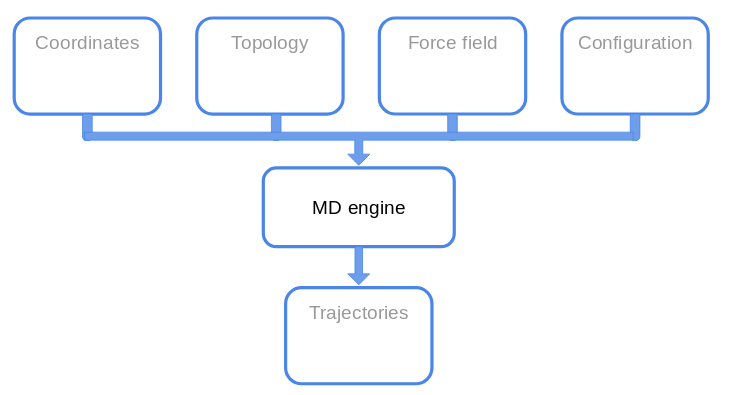
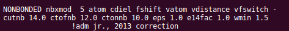
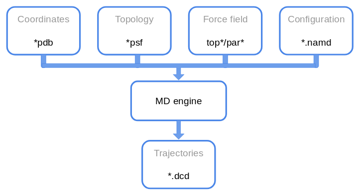
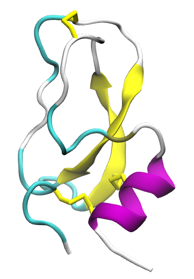
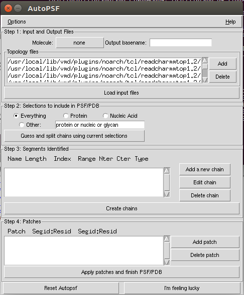
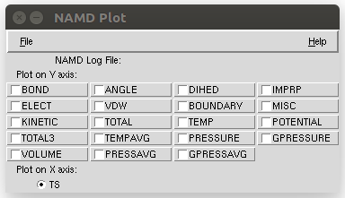

<script src="https://cdnjs.cloudflare.com/ajax/libs/mathjax/2.7.0/MathJax.js?config=TeX-AMS-MML_HTMLorMML" type="text/javascript"></script>


In this session we will build the setup, analyse the configuration file and
perform a small analysis of a system.[^1]

[^1]: This tutorial is based on [NAMD tutorial]() and [BPTI case study]().

I encourage you to have a look at the
### Getting ready
For this tutorial, download the following
#FIXME: add source [source file]().
You should know how to untar, but let's remind it:
<p class="prompt prompt-shell">$ tar xvzf tutorial3.tar.gz</p>

#FIXME: add folderlist
There should be two folders: `foo/` and `bar/`.

## Overview
Let's recap the so called **MD machinery**.

<p class="prompt prompt-question">What files do we need?</p>



## PAR file
Last time we saw the several files, but we did not have a look at the parameters
file.
Let's open `par_all36m_prot.prm` with _ViM_.
There is a section for all the interaction we saw last time.

<p class="prompt prompt-question"> Do you see other potential functions not
defined in the last lesson?</p>

We  mentioned that the force field has to be taken as a whole, since several
approximations are hidden in the parameter definition.

Other _parameters_ must be set for the non-bonded interactions (the exact meaning
  will be defined in other lessons):


The meaning of these commands is not important for this tutorial, but the
take-home message to remember is:

<p align="center">"You should **not** change parameters at your own will, unless
 you want to introduce a systematic error in your simulation
  and make them useless.""</p>

or, in another way:
<p align="center">First rule of the FF-Club is **Do not mess with the FF**.</p>

 (Credits: [La Scienza Coatta](https://www.facebook.com/LaScienzaCoatta/))


So, now we have an (almost) complete overview of the files we will deal with.

Congrats for the correct answer! ;)


## The Problem
Before launching a simulation, let's see what are the time scale we can
investigate. For now, with _MD_ we mean _all-atom MD_.


From the picture above we see that we are constrained both spatially and in the
simulated time, since the idea is to publish and we don't have infinite resources
(someone pays the bill for the electric power used by computers).

When you decide to perform a simulation some questions should be answered in advance:
1. What process I want to investigate? Is it feasible?
2. Do I have enough resources? (in general you hope so)
3. What level of detail do I need?

We will keep these question in mind, but we will ignore them for now.


## MD in a nutshell
We have already seen that performing a molecular dynamics simulation means solving
numerically the Newton's equations of motion for each atoms in order to evolve the
system at the next time step.

To do so, we usually employ the (velocity-)Verlet algorithm, described below.

<p align="center">
$$
\begin{align*}
    r_i(t+\Delta t) & = r_i(t) + v_i(t) \Delta t+ \frac{\Delta t^2}{2m_i}F_i(t)\\
    v_i(t+\Delta t) & = v_i(t) + \frac{\Delta t}{2m_i}\big[F_i(t+\Delta t) + F_i(t)\big]\\
\end{align*}
$$
</p>

<p class="prompt prompt-question">What information do we need to implement the
Verlet algorithm?</p>

<p align="center">
<br>
<br>
<br>
<br>
<br>
<br>
<br>
suspence...
<br>
<br>
<br>
<br>
<br>
<br>
<br>
</p>

We will need to provide:
1. the initial positions of the atoms in the system;
2. the potential energy to compute the forces from;
3. the masses of the atoms;
4. the time step of integration;
5. the initial velocity of atoms.

We already saw the first three requirements.

The **time step** should be as large as possible, in order to achieve
long simulated times. But (there is always a caveat) we do not want to have
huge errors due to the integration. Moreover with super-long time step, atoms
will move too much and they would overlap resulting a high repulsive force.
<p class="prompt prompt-question">How is the repulsive force implemented?</p>
The choice of the time step in based on the fastest motion in the system.
In particular, it should be 1/10 of this fastest motion. For all-atom simulation,
the hydrogen vibrations in bonds with heavy atoms have a period of ~10 fs.
Therefore we would use a timestep of 1 fs (**maybe**).

The initial velocities are in general assigned from a Maxwell-Boltzmann
distribution at the desired temperature, but they can be set to a random values,
extracted from a uniformdistribution etc...

With all these pieces of information, we can performed a simulation in a,
so called, **NVE ensemble** [^3], where the number of particles, the volume and
the total energy of the system is conserved.

[^3]: Please notice it is written with the **e**, ens**e**mble.

But usually, we want to compute quantities that the experimentally measured. And
in experiments what is fixed is not the energy but the temperature, or not the
volume but the pressure.

Therefore, we need to introduce two new ingredients that will be explained in the
theoretical lessons: a _thermostat_ and a _barostat_.
These two pieces will help us in simulating our system in the correct ensemble,
**NVT** and **NpT**.

An ingredient that is not evident from the above discussion is ihe necessity to
reproduce experimental results.

The workflow of your simulation would look like this:
1. build the setup:
2. minimise the system;
3. equilibrate the system in **NVT**;
4. equilibrate the system in **NpT**;
5. go back to **NVT** to reduced the perturbation introduced in your system.

Depending on the system, step _5_ may not be performed.


## BPTI
The _bovine pancreatic trypsin inhibitor_ is a small protein extensively studied
since the dawn of Molecular Dynamics. It inhibits the enzyme trypsin, responsible
for the protein digestion.




It was the first macromolecule of biological relevance simulated with MD with the
seminal paper  _Dynamics of folded proteins_ by McCammon, Gelin and Karplus.

The BTPI binds the trypsin hindering the ability of cleaving other proteins.
For more details, see the _Notes_.

Load the complex in the `bpti_trypsin/` folder and check the `LYS15` of the bpti.


### PSF
Let's start from the pdb of the protein alone from the previous tutorial.
We will build again the `psf` with the _AutoPSF_ plugin.

Open _VMD_ in your working folder `tutorial3`, and load your pdb file.
Now go to _Extension -> Modeling
-> Automatic PSF Builder_.
A new window pops up:



If you click on _Options_, you see some flags.
This leads us to a small correction to what was said last time.
When building the `psf`, the position of the angles and dihedrals are
recomputed according to the topology file. Therefore the minimisation has
less impact on matching the `pdb` coordinates with the _ideal_ 3D arrangement.
<p class="prompt prompt-attention">Still do the minimisation for the steric
clashes!</p>

The steps we will perform is:
1. Check if our molecule is properly loaded;
2. Select the output name or use the default one;
3. Delete the default `top*` files and add our own;
4. Load the input files;
5. Guess and create the chains;
6. Check if our patches are automagically imported;
7. Finish the psf.

<p class="prompt prompt-attention">
Check the correctness of the patches! </p>

It will create and load a new molecule, both `psf` and `pdb`.

## Implicit solvent
Last time we performed few time step of a simulation in vacuum. Of course,
proteins do not _live_ in the outer space in a _galaxy far, far away..._
(unless we are studying *Midi-chlorian*, ça va sans dire).

Proteins lives in an aqueous environment, with ions, all kinds
of ligands and so on and so forth. We would like mimic as good as possible
the biological environment by adding **explicitly** water molecules. This will
be done in few steps. But in this section we will use an **implicit solvent
model**.

**Implicit Solvent** model is a computational technique that introduces many
effects due to solvent-solute interactions, such as screening effects,
without using the water atoms. Removing the water molecules accelerates
the simulation both in the exploration of the solute conformations,
and in the _CPU time_ required to actually do the computation.

<p class="prompt prompt-attention">Implicit models are less accurate than
the explicit counterpart!</p>

In particular we will use the _Generalised Born implicit solvent_ (**GBIS**)
model. The details are left for the theoretical part of the course.
The main idea is to screen more the atoms nearby the surface of the protein nearby
the solvent (and give them a _small effective radius_) and the opposite for the buried atoms inside the protein.

The parameters that we have to set are:
- `gbis yes`: we want to use the _GBIS_;
- `cutoff 14`: for the electrostatic interactions (in Angstrom);
- `alphaCutoff 12`: to determine the appropriate radius (in Angstrom);
- `ionconcentration `: the default value is `0.2`.

Let's open the configuration file for this simulation and see what is inside.
<p class="prompt prompt-info">The section we will not discuss are defined by <br>
# <--! <br>
... <br>
# !--> </p>

Fix the lines left blank in the configuration file, and then launch the
simulation.

This time we will slightly modify the launching command:
<p class="prompt prompt-shell">$ namd2 +p2 conf.namd > bubu.log &</p>


To check how much time the program needs, type in the shell:
<p class="prompt prompt-shell">$ grep "^TIMING" bubu.log </p>
For 100k steps it will take 20 minutes.


Several files will be dumped from NAMD:
- `.log` file;
- `.dcd`: trajectory;
- `.restart.*`: to restart the simulation;
- `.coor`: binary for coordinates;
- `.vel`: binary for velocities;
- `.xsc/.xst`: for the simulation box;

Let's start from the `.log` file.
Let's open it with _ViM_. There are a lot of information written in it, such as
the initialisation of the system, checking the number of atoms, the existence of the
files, the correctness of the parameters file, the recap of the setup defined
in the configuration file.

Search the word `Benchmark`. The data you find here are useful to establish
the amount of resources (CPU/GPU) you should use.

Then we can check the thermodynamics quantities we asked to compute on the fly.
They will be written as row each defined timestep.
The keywords are `ETITLE` to have the headers of the columns, and `ENERGY`
for the actual values.

While the simulation is running, you can write a `tcl` script to compute the
_Root mean square displacement_ of the protein. It is defined as:

$$ RMSD = \sqrt{\frac{1}{N} \sum_i^N (r_i(t) - r_i(0))^2}$$

Usually it is performed considering only the C$$\alpha$$ and the following
procedure is followed:
1. Align the structure of each frame to the first frame structure, in order
to remove the roto-translation of the system;
2. Compute the RMSD.

This quantity gives a qualitative estimate of the convergence of the simulation.
We can define two segments of the total simulated time:
- an **equilibration** phase that allows the system to reach the """equilibrium"""
- a **production** phase from which we will compute the data we want.

A criterion to check the equilibration of a system is to check for a plateau
in the _rmsd_.

<p class="prompt prompt-question">Write the rmsd.tcl script</p>

Once the simulation is completed, let's analyse the output in the `.log` file.

In _VMD_ go in _Extension -> Analysis -> NAMD Plot_.
You should see this:


Load the `.log` file and analyse the `TEMP`.

<p class="prompt prompt-question">Can you explain the behaviour of the
temperature?</p>.

We can also save the extracted info, but it is too cumbersome (imho).
So let's use the `shell`.

The idea is to extract from the `log` file some lines. We will use the following
commands:
<p class="prompt prompt-shell">$ grep "^ETITLE" bubu.log |
tail -n 1 > thermo.dat <br>
$ grep "^ENERGY" bubu.log > > thermo.dat</p>

See if the file is properly written. And now let's plot something.
<p class="prompt prompt-shell">$ gnuplot <br>
> set key autotitle columnheader<br>
> p "thermo.dat" u 2:13 w l </p>

Check the potential energy `14`, the total energy `12`.
Compare in the same plot the temperature `13` with the average temperature `16`.

## Explicit Solvent
If we want to simulate a protein in a water box, we should build a water box
(<<Elementary, my dear Watson!>>).

The idea is to create a box
To do so, we can use the `solvate` package in _VMD_. In the _Tk console_:
<p class="prompt prompt-tk">% solvate</p>
and let's see the option we can use.

<p class="prompt prompt-question">Solvate the system!</p>
Rotate the system and add a padding of 9 Angstrom.

The water box will define also our simulation box, a cube.
Since we will use the periodic boundary conditions, we do not want that
the protein interacts with its own image, so we cannot choose a padding too
small. The protein should be **at least** 14 A from its image.

This **at least** works only for this tutorial. For production runs, you should
take into account the autocorrelation of the water molecules with themselves.
Therefore, as a rule of thumb, you should use a padding of 18 A. Of course you
can use a padding of 50 A, but it is a waste of resources.

To perform a visual check, be sure that your solvated molecule is loaded as *top*.
Let's first shift to the center of the box with the command:
<p class="prompt prompt-tk">
% set all [atomselect top "all"] <br>
% $all moveby [vecinvert [measure center $all]]<br>
% $all writepdb solvated_centered.pdb </p>
We wrote down the new coordinates because they will be useful in the following.

Now that the protein is centered in `(0,0,0)`, let's measure the extension of
box:
<p class="prompt prompt-tk">
% measure minmax $all
</p>
This command gives us the `x_min, y_min, z_min` and `x_max, y_max, z_max` of
the box. Taking the difference along each axis, $$\Delta x$$ etc,
gives use the three sizes of the box.

Let's tell _VMD_ what the **unit cell** looks like:
<p class="prompt prompt-tk">
% molinfo top set a _..._ <br>
% molinfo top set b _..._ <br>
% molinfo top set c _..._
</p>
and visualise the images. Go to _Graphics -> Representation -> Periodic_ and
put a tick in _-X +X -Y +Y_.
You can also measure the distance between atoms with the usual command `2`.


Once the visual inspection is done, we would like to add ions, too.
""**Why do we need ions?**" I hear you ask...

There are two reasons for ions. The trivial one is because there are ions in
solution in cells. The obscure, for now, reason is related to computation of the
electrostatic interactions. But it will be clearer later in the course ;)

This time we will use the GUI to _ionise_ the system.
First delete all the loaded molecules, and reload the `psf` and the new `pdb`.

Go to _Extension -> Modeling -> Try-to-guess_.

We will neutralise the charge in the system and add a 0.1 M ion concentration.
<p class="prompt prompt-question">Why is our system charged in the first place?</p>

Let's run the simulation. As a guideline, let's remind the procedure
we should follow for a production simulation:
1. minimisation;
2. heavy atoms of the protein harmonically restrained to their starting positions
while the solvent equilibrates arount the protein;
3. NVT simulation to go into the canonical ensemble;
4. Add the pressure.

We will run an _NpT_ simulation just to get accustomed to the new option.
You already know what lines you should fill, but now we have two more things to add.

<p class="prompt prompt-attention">Use the centered box!!!</p>

First, now our system has also water molecules, therefore we need a new
parameter file.
It's in the _VMD_ plugin folder.

Second, we have to set the center and the `a b c` of the box.
The center should be `0.0 0.0 0.0` because of one of the previous commands,
and the _cellVectors_ are
```
cellBasisVector1 _Delta x_  0.0  0.0
cellBasisVector2   0.0   _Delta y_ 0.0
cellBasisVector3   0.0  0.0  _Delta z_
```

First launch the simulation with 1 core:
<p class="prompt prompt-shell">$ namd2 conf.namd > lognameN.log & </p>
Does it work?
<p class="prompt prompt-question">$ What is the problem related to?</p>


Now try to launch `namd` using more cores:
<p class="prompt prompt-shell">$ namd2 -pN conf.namd > lognameN.log & </p>
where `N` is the number of cores available.
Launch the same simulation using 2,3,4 processes (change also the logfile name).
In general you should be able to run with `4` cores,
but remember that your computer needs some resources for the
opetating system. Therefore, you may not see an increase in the performances
for 3 processes to 4.
<p class="prompt prompt-attention">
1) The output will be overwritten.<br>
2) If you want to do a for-loop modify the command above (hint:`&`)
</p>

This time with 4 cores, the simulation takes ~50min for 100k steps.

# AWK detour
_AWK_ is a scripting language to manipulate text. It is particular useful for small
tasks that do not rqeuire a lot of lines of code.

The basic syntax of an _awk_ instruction is:
`awk '{some actions}' < input.file`.
_awk_ will loop over the lines of the file and perform the actions you wrote.
The default variables you will need are:
- `NF`: number of fields (i.e. columns separated as default by blank spaces);
- `NR`: number of rows (i.e. lines), the counter over which the default
 loop is performed;
- `$0`: a whole line;
- `$i`: the i-th field;
Moreover you can do operation at the before (`BEGIN`) and after (`END`)
 the main loop.
First, create a file with 1 column filled with numbers from 1 to 100.
**Hint**: use a bash for-loop.

Then, let's compute the sum and the average.
```bash
awk 'BEGIN{sum=0} {sum += $1} END{print "sum:", sum, "\navg:", sum}' < gauss_spicciame_casa.dat
```
See _Notes_ for more information and fancy things[^2].

[^2]: Rtfm on `man awk`, or use Google/StackOverflow.


Now that we know a bit of _awk_, let's use it for our purposes.
First let's see how different numbers of cores affect the computation.
<p class="prompt prompt-shell">$ grep "Benchmark" logname1.log |
 awk '{print $X, $Y, $Z}' > benchmark.dat </p>

Of course we can do the same for all the 4 logfiles.
<p class="prompt prompt-question">When do you have the ""best"" perfomances?</p>

We saw the `TIMING` and `Benchmark` lines.
<p class="prompt prompt-question">What is the difference according to you?</p>

We can also use `awk` to get rid of the unwanted columns in the `thermo.dat`
we obtained before.
<p class="prompt prompt-question">Make a file with timestep and temperature only,
using awk.<br>
Try to compute the average of the same two quantities for the "equilibrated"
 part with _awk_</p>

Let's compute the RMSD for the simulation with explicit solvent.

<p class="prompt prompt-question">Compute the radius of gyration of
the protein in implicit and explicit solvent</p>


<!--
#TODO: compare fluctuation of temperature for 100ps in implicit and explicit
#TODO: provide the dcd
-->
# Further Notes
1. [NAMD User guide]()
2. Molecular Modeling of Proteins, edited by Andreas Kukol.

---
# Notes

#FIXME: fix notes
