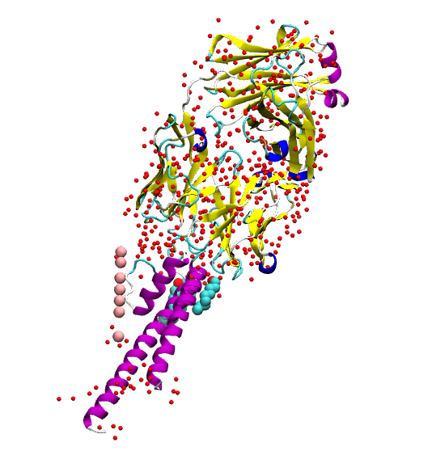
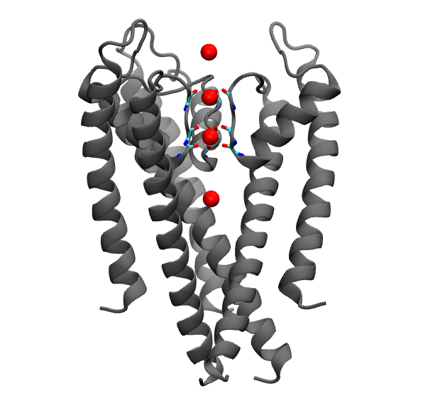
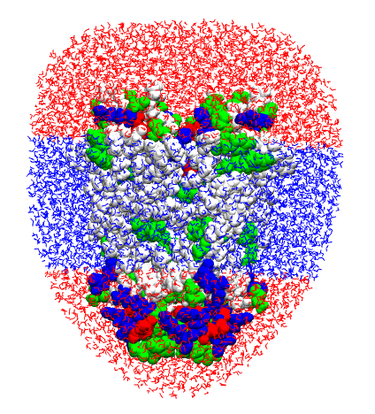

<script src="https://cdnjs.cloudflare.com/ajax/libs/mathjax/2.7.0/MathJax.js?config=TeX-AMS-MML_HTMLorMML" type="text/javascript"></script>


In this session we will build the setup for the KcsA, a membrane protein,
and the step to perform the simulation.

The files you need are available [here](https://drive.google.com/file/d/1LbPQvlZb5F8V8nPFuzhlyDFoEK7IAAQ0/view?usp=sharing).

[^1]: See [Membrane tutorial](https://www.ks.uiuc.edu/Training/Tutorials/science/membrane/mem-tutorial.pdf) for the references.

# Disclaimer
Today we will use CHARMm 27 ff, although in general you should use the
latest forcefield available.

You are, as always, encourage to read the tutorial in the _Notes_.
## Membrane protein
Membrane proteins are usually more difficult to simulate with respect to
soluble proteins. The difficulties are mainly related to the unavailability
to have experimental crystal structures, and to the longer timescale that
must be explored.

We will build the setup of the KcsA, a potassium channel membrane protein.
Your setup will look like this:


Except from the change in the ion composition (this time KCL), we can see
that obviously we need to add a membrane patch.


## Our challenge
If we over-simplify the steps, our goal is to apply the following equation.

<p align="center"> The equation of love <3.</p>

<p class="prompt prompt-question">How do we go from the left side of the
equation to the right side?</p>
<p>
<br>
<br>
<br>
<br>
<br>
<br>
<br>
<br>
<br>
<br>
<br>
<br>
<br>
<br>
<br>
<br>
</p>

The road map is:
1. Download and modify the experimental `pdb`;
2. Obtain the tetramer;
3. Create a membrane patch;
4. Insert the protein inside the membrane;
5. Solvate and ionise the sytem.

Let's see in details all the steps.

## The protein
Download from the [PDB website](https://www.rcsb.org) the entry `1K4C`.
<p class="prompt prompt-question">Have a look at the biological assembly!</p>

From the website you can already see how the protein is arranged within the membrane.

Let's open the `pdb` in _VMD_ and visualise it.



In this system we see that there is not only our protein (the alpha helices).
We have also water molecules, several potassium ions, few lipids and antibody
fragments that is used to crystalise the protein.
<p></p>
<p class="prompt prompt-question"> Visualise the protein secondary structure and
colour it by chain.</p>
<p></p>
<p class="prompt prompt-question">How many chain are there?</p>

Take note of the chain we need for our setup.

Let's now investigate the `pdb` file, and go and check the remarks `350`,
`465` and `470`.
<p></p>
<p class="prompt prompt-question">What do these remarks tell us?</p>
<p></p>

Now we have two pieces of information: the first one is that our system is a
tetramer (`REMARKS 350`); the second one is that we have the matrix to apply
to the system to obtain the biological assembly.

As you can see the matrix is a 3 by 4 matrix, to which we have to add a
row `{0.0 0.0 0.0 1.0}` to obtain a 4 by 4 matrix that is used by _VMD_
to apply roto-translations.


Let's start from building the whole tetramer. The axis of rotation will be the _z_ axis,
and the tetramer will be built arount the `K` ions.

What we are doing here is to create 4 `pdb` files with a different `segname`.

After loading the `1K4C.pdb`, let's set an appropriate `segname` for the first
element of the tetramer (to which we will apply the identity matrix). So we just
set the segname only.

```
mol new 1K4C.pdb
set all [atomselect top all]
$all set segname A
$all writepdb KCSA-A.pdb
$all delete
```

Then we apply the second matrix to our system and we change the `segname` too.
Of course we save the system also this time.
<p class="prompt prompt-attention"> Check the new selection!</p>
```
set sel [atomselect top "all and not name K"]
$sel set segname B
$sel move { {-1.0 0.0 0.0 310.66} {0.0 -1.0 0.0 310.66} {0.0 0.0 1.0 0.0} {0.0 0.0 0.0 1.0} }
$sel writepdb KCSA-B.pdb
$sel delete
mol delete top
```
At the end we deleted the structure, since we changed the coordinates and
the matrices are given for the given pdb.
<p class="prompt prompt-question">Complete the tetramer by applying the
other transformations.</p>

When you have the four files, we need to join them in one file:
<p class="prompt prompt-shell">$ cat KCSA-A.pdb KCSA-B.pdb KCSA-C.pdb   KCSA-D.pdb > KCSA.pdb</p>

You have to delete the lines `END` and `CRYST1 ...` that you have in the
middle of your file.

<p class="prompt prompt-question">Visualise the whole system</p>
<p></p>

The system is now complete, but we want to simulate only the channel,
therefore we need to emend the structure.

Let's remind what we are doing.
The **goal** is to create the **psf** for the tetramer. To do so, we need a
`psf` for each part of the system that is not covalently bonded to other parts.

First, let's save only the part we are interested in. Of course we will
have several pdb files, one for each segment.

Due to the definition of the `segname` in the previous step,
we can introduce a new `for` loop in _Tcl_ that iterates over all the
elements of a list: `foreach`.

<p class="prompt prompt-attention">Check the script before you execute them,
since there are missing values to be filled in!</p>
Load the `KCSA.pdb` and in the _TkConsole_:
```
foreach S { A B C D } {
  set seg [atomselect top "segname $S and chain _whatChain?_ and protein"]
  $seg writepdb seg$S.pdb
  $seg delete
}
```
In this way, we wrote a pdb file for each monomer.
<p class="prompt prompt-question">Check the new files! </p>

We want also to save the potassium ions. We will save only four out of the
seven atoms.


We selected two positions of the ions that are known to be occupied in
the filter, and we keep also two ions, one in the extracellular and
one in the intracellular region.

<p class="prompt prompt-attention">Pay attention to the 'atom name' of the
potassium atoms!</p>

```
set pot [atomselect top "name K and resid 3001 3003 3005 3006"]
$pot set name POT
$pot set resname POT
$pot writepdb pot.pdb
```

We will modify the remaining three `K` into water molecules.
**It's a kind of magic**

```
set npot [atomselect top "name K and resid 3002 3004 3007"]
$npot set name OH2
$npot set resname TIP3
$npot writepdb filtwat.pdb
```

We have now two more files: `pot.pdb` and `filtwat.pdb`

We want also to save the water crystalised nearby the channel:
```
foreach S {A B C D} {
  set wat [atomselect top "segname $S and
  resname HOH and within 10 of (chain C and protein)"]
  $wat writepdb crystwat$S.pdb
  $wat delete
}
```

Now the system is almost ready for the creation of the `psf` file.
Before that, we need to check the protonation states of charged residue and
of the hystidines.

First, visualise in the `KCSA.pdb` the hystidine and cysteines.
<p class="prompt prompt-question"> Are there disulfide bonds? (Check the
distances)</p>

The hystidine will be set as `HSE`.

For the charged residue, visualise in _Licorice_ `charged and chain C`.
Most of the arginines are located in regions likely to be solvated, so they
are kept charged.

Take a closer look at `ASP80` and `GLU71`. They are both negatively charged,
so problably one of them is protonated (they interact also with a water
molecule). We will define the glutamic acid as `GLUP` (it's a patch!).

We are now ready to create the psf.
Write a file `kcsa_psfgen.tcl`:
```
mol delete all
package require psfgen
topology _fill-me-prot_
topology _fill-me-wat_
pdbalias residue HIS HSE
pdbalias atom ILE CD1 CD
pdbalias atom HOH O OH2
pdbalias residue HOH TIP3
foreach S { A B C D } {
  segment $S {
    pdb seg$S.pdb
  }
  coordpdb seg$S.pdb $S
  patch GLUP $S:71
  regenerate angles dihedrals

  segment WC$S {
    auto none
    pdb crystwat$S.pdb
  }
  coordpdb crystwat$S.pdb WC$S
}

segment I {
  pdb pot.pdb
}
coordpdb pot.pdb I

segment WF {
  auto none
  pdb filtwat.pdb
}

coordpdb filtwat.pdb WF
guesscoord
writepdb kcsav.pdb
writepsf kcsav.psf
```

Launch the script and check if there are errors in the output.

# Solvate (optional)
We would like to add a water shell to our protein. To do so, we can you a
software by the Grubmueller's group.
You have to download [solvate](https://www.mpibpc.mpg.de/grubmueller/solvate) and, after compiling it, you should run:
```
solvate -t 3 -n 8 -w kcsav solkcsa
```
and then you should join the proteina and the water shell.
Here there is the script you should use, but the complete files are
already provided.
```
set sol_infile solkcsa.pdb
set kcsa_inbase kcsav
set outbase kcsav_solv_raw
package require psfgen
resetpsf
topology _fill-me-with-water-top_
segment SOLV {
  auto none
  first NONE
  last NONE
  pdb $sol infile
}
coordpdb $sol_infile SOLV
readpsf ${kcsa_inbase}.psf
coordpdb ${kcsa_inbase}.pdb
writepdb ${outbase}.pdb
writepsf ${outbase}.psf
```

# Protein orientation
The goal of this subsection is to orient correctly the protein.

First, load the `psf` and `pdb` file and let's center our system.
```
set all [atomselect top "all"]
$all moveby [vecinvert [measure center $all]]
display resetview
```

The membrane patch will have a thickness of 30 Angstrom. We will delete
the water molecules that are in hydrophobic region of the protein.

<p class="prompt prompt=question">Visualise the protein in VdW and ResType
as Coloring Method.</p>

We will also colour the water molecules according to their _z_ coordinates.
Let's colour the water in _Blue_. Add two more representations for the
`water and z < -20` and `water and z>10` in _Red_. You should have
something like:

<p></p>

<p class="prompt prompt-attention">Always visualise that you are going to remove!</p>

In order to remove the central water, the scheme to be followed is:
1. define a selection that contains the molecules we want to get rid of;
2. assign to the selection a custom `beta` factor (usually `1`);
3. extract a `segid` and `resid` for each molecule with `beta > 1` (for water we will select only the oxygen atom);
4. load `psf` and `pdb` and delete the unwanted residues.

In practice, we select only the water added later with the `solvate`
external package:
```
set solv [atomselect top "segname SOLV"]
$solv set beta 1
```    
Then we set `beta 0` to the water molecule we want to retain.
```
set seltext "segname SOLV and same residue as ((z < -20) or (z>10))"
set sel [atomselect top $seltext]
$sel set beta 0
```
and then we build two lists with `segid` and `resid` that univocally define
a residue.
```
set badwater [atomselect top "name OH2 and beta > 0"]
set seglist [$badwater get segid]
set reslist [$badwater get resid]
```
Finally, we delete the select residues.
```
mol delete all
package require psfgen
resetpsf
topology _path_to_top all27 prot lipid.rtf
readpsf kcsav_solv_raw.psf
coordpdb kcsav_solv_raw.pdb
foreach segid $seglist resid $reslist {
delatom $segid $resid
}
writepdb kcsa_solv.pdb
writepsf kcsa_solv.psf
```

The position of the protein inside a membrane can be identified visually
by the hydrophobic region of the protein, usually limited by rings of Tyrosine.
There are available also web software, like OPM, that gives a plausible orientation for membrane proteins.  

# Membrane patch
Now we want to model a membrane.

Create a membrane 90x90 Angstrom of POPC (a kind of lipids generally used
im membrane protein simulation). Use the _CHARMm 27 ff_.

<p class="prompt prompt-question">Find the way to build the membrane</p>

After building it, the membrane, oriented with the _z_ axis normal to its
surface, is loaded by default.

<p class="prompt prompt-question">Center the membrane and same the new
coords as popc_TEMP.pdb </p>

As a convention, the setup has the membrane parallel to the _xy_ plane, and the
protein is aligned to the z axis.

Load the `kcsa_solv.p*`. We want to center the protein using the center of mass
of residue 97 to 106.
```
set vest [atomselect top "protein and resid 97 to 106"]
$kcsa moveby [vecinvert [measure center $vest weight mass]]
display resetview
$kcsa move [transaxis z -25]
$kcsa writepdb kcsa_TEMP.pdb
```

And we now join the two structure: protein and membrane.
```
mol delete all
package require psfgen
resetpsf
readpsf popc.psf
coordpdb popc_TEMP.pdb
readpsf kcsa_solv.psf
coordpdb kcsa_TEMP.pdb
writepsf kcsa_popc_raw.psf
writepdb kcsa_popc_raw.pdb
file delete kcsa_TEMP.pdb
file delete popc_TEMP.pdb
```


The system is not yet the final one. In fact, we need to remove the lipids that
overlap the protein.
Load the latest files:
```
mol delete all
mol new kcsa_popc_raw.psf
mol addfile kcsa_popc_raw.pdb
```
and visualise the lipids by using the selection defined below.
```
set POPC "resname POPC"
set all [atomselect top all]
$all set beta 0

set seltext1 "$POPC and same residue as \
(name P and z>0 and abs(x)<15 and abs(y)<15)"
set seltext2 "$POPC and same residue as \
(name P and z<0 and abs(x)<10 and abs(y)<10)"
set seltext3 "$POPC and same residue as (within 0.6 of protein)"
set sel1 [atomselect top $seltext1]
set sel2 [atomselect top $seltext2]
set sel3 [atomselect top $seltext3]
$sel1 set beta 1
$sel2 set beta 1
$sel3 set beta 1
set badlipid [atomselect top "name P1 and beta > 0"]
set seglistlipid [$badlipid get segid]
set reslistlipid [$badlipid get resid]
```

With the membrane, also water molecules are generated. We need to remove them all.
```
set seltext4 "(water and not segname WCA WCB WCC WCD WF SOLV) \
and same residue as within 3 of \
((same residue as (name P1 and beta>0)) or protein)"
set seltext5 "segname SOLV and same residue as \
within 3 of lipids"
set sel4 [atomselect top $seltext4]
set sel5 [atomselect top $seltext5]
$sel4 set beta 1
$sel5 set beta 1
set badwater [atomselect top "name OH2 and beta > 0"]
set seglistwater [$badwater get segid]
set reslistwater [$badwater get resid]
```

As we saw before, we will now delete the unwanted residues.
```
mol delete all
resetpsf
readpsf kcsa_popc_raw.psf
coordpdb kcsa_popc_raw.pdb
foreach segid $seglistlipid resid $reslistlipid {
  delatom $segid $resid
}

foreach segid $seglistwater resid $reslistwater {
  delatom $segid $resid
}
writepsf kcsa_popc.psf
writepdb kcsa_popc.pdb
```
# Solvate and ionise
Now, you have to solvate and ionise (0.4M KCl) the system.
For the _xy_ dimension, use the `minmax` of water. Add 5 Angstrom above and below
in the _z_ axis.

Use:
```
package require solvate
solvate kcsa_popc.psf kcsa_popc.pdb -o kcsa_popc_water_TEMP -b 1.5 -minmax { {vec1} {vec2} }
```

If we draw the water molecules just added, we see that some of them are
within the membrane. We have to delete them!

Let's visualise the unwanted molecules, remember to not apply it to the
`WF`,`WCA/B/C/D`, `SOLV`.
Once you have defined the `seglist` and `reslist` we can delete the selected
residues.
```
mol delete all
package require psfgen
resetpsf
readpsf kcsa_popc_water TEMP.psf
coordpdb kcsa_popc_water TEMP.pdb
foreach segid $seglist resid $reslist {
delatom $segid $resid
}
writepdb kcsa_popcw.pdb
writepsf kcsa_popcw.psf
file delete kcsa_popc_water_TEMP.psf
file delete kcsa_popc_water_TEMP.pdb
```

Finally we can add the ions with the _Add ions_ package.

## Running the simulation
We are ready to launch the simulation.

<p class="prompt prompt-attention">Check each conf file individually
to check that every command is properly defined </p>

For this system, we will follow several steps.

**First**, we need to equilibrate the lipidic tails with `*-01.conf` in NVT.

<p class="prompt prompt-attention">Modify the PME</p>
<p class="prompt prompt-attention">Is there something you have never seen?</p>
We should tell _NAMD_ what to keep fixed.

**Second**, we will restart the simulation and let everything move,
but for the protein that will be harmonically restraints.
The aim is to let the membrane close the gap with the protein.

We will use the `tcl` script `keep_water_out.tcl` to expel the water
molecules that flow until the system is compact enough to prevent it.

We can define exception for water molecules nearby the protein (the `WF`, `WCA/B/C/D`).

**Third**, we release also the protein to perform the equilibration.

**Finally**, we can launch the actual simulation, keeping now constant
the area of the system.


# Notes
