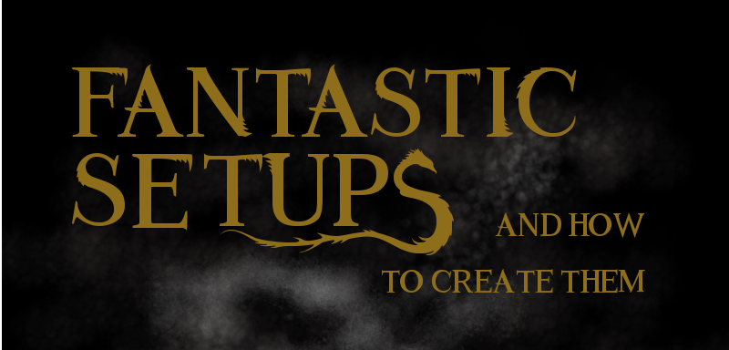
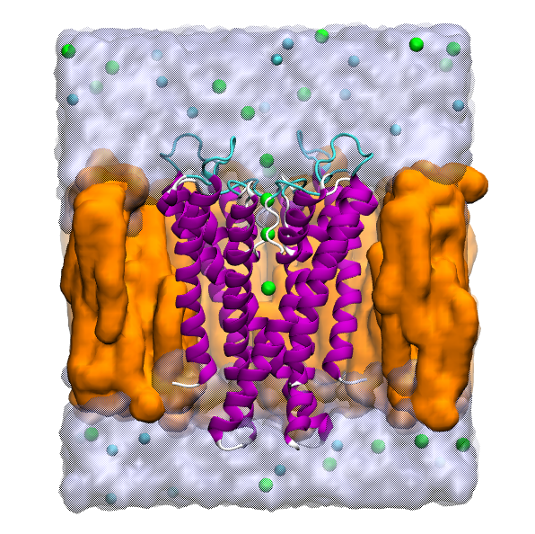
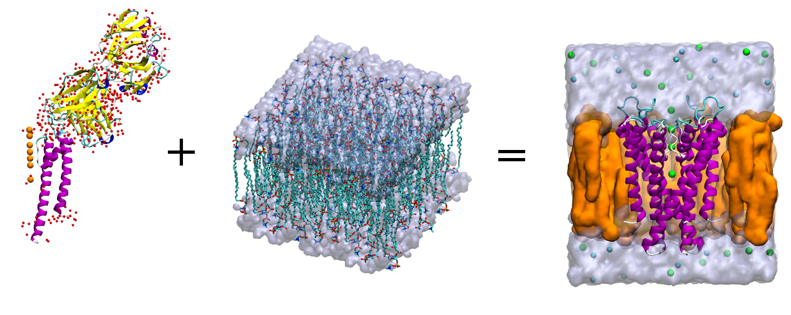
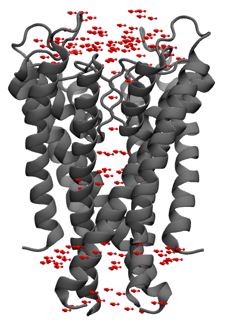

<script src="https://cdnjs.cloudflare.com/ajax/libs/mathjax/2.7.0/MathJax.js?config=TeX-AMS-MML_HTMLorMML" type="text/javascript"></script>


Welcome to the new episode of:



In this session we will complete the setup for the membrane protein KcsA and we will analyse the configuration files to perform the simulation[^1].

[^1]: See [Membrane tutorial](https://www.ks.uiuc.edu/Training/Tutorials/science/membrane/mem-tutorial.pdf) for the references.

The updated files you need are available [here](https://drive.google.com/file/d/1DA6XUkxuyqmfOWhCmT7IYZ9UO6Wv-FgH/view?usp=sharing).
The archive contains the latest system we obtained last time (with
CHARMm 36 :|) and the configuration files.

You are, as always, encouraged to read the tutorial in the _Notes_.

## Previously on FS&HTCT
What we want to obtain is something like the following setup:


# Recap
We want to go from the `1K4C.pdb` to the tetramer embedded in a lipidic bilaryer.

<p align="center"> The equation of love <3.</p>

What we did last time:
1. Built the tetramer from the experimental pdb;
2. Extracted the chains we were interested in, i.e. the channel helices,
the potassium ions, and the waters;
3. Solvated the structure with a layer of water and delete the excess of water;
4. Created the membrane patch.

We will continue now from this point.

# Membrane patch
Create a membrane 90x90 Angstrom of POPC (a kind of lipids generally used
im membrane protein simulation). Use the _CHARMm 36 ff_.

<p class="prompt prompt-info">We changed the ff, soz!</p>

After building it, the membrane, oriented with the _z_ axis normal to its
surface, is loaded by default.

<p class="prompt prompt-question">Center the membrane and save the new
coords as popc_TEMP.pdb </p>

As a convention, the setup has the membrane parallel to the _xy_ plane, and the
protein is aligned to the z axis.

Load the `kcsa_solv.p*`. We want to center the protein using the center of mass
of residue 97 to 106.

Assuming that the protein is loaded as the top molecule:
```
set kcsa [atomselect top "all"]
set vest [atomselect top "protein and resid 97 to 106"]
$kcsa moveby [vecinvert [measure center $vest weight mass]]
display resetview
$kcsa move [transaxis z -25]
$kcsa writepdb kcsa_TEMP.pdb
```

And we now join the two structure: protein and membrane.
```
mol delete all
package require psfgen
resetpsf
readpsf popc.psf
coordpdb popc_TEMP.pdb
readpsf kcsa_solv.psf
coordpdb kcsa_TEMP.pdb
writepsf kcsa_popc_raw.psf
writepdb kcsa_popc_raw.pdb
file delete kcsa_TEMP.pdb
file delete popc_TEMP.pdb
```


The system is not yet the final one. In fact, we need to remove the lipids that
overlap the protein.

<p class="prompt prompt-info">Always visualise what you want to delete!</p>
<p></p>

Load the latest files:
```
mol delete all
mol new kcsa_popc_raw.psf
mol addfile kcsa_popc_raw.pdb
```
and visualise the lipids by using the selection defined below.
```
set POPC "resname POPC"
set all [atomselect top all]
$all set beta 0

set seltext1 "$POPC and same residue as \
(name P and z>0 and abs(x)<15 and abs(y)<15)"
set seltext2 "$POPC and same residue as \
(name P and z<0 and abs(x)<10 and abs(y)<10)"
set seltext3 "$POPC and same residue as (within 0.6 of protein)"
set sel1 [atomselect top $seltext1]
set sel2 [atomselect top $seltext2]
set sel3 [atomselect top $seltext3]
$sel1 set beta 1
$sel2 set beta 1
$sel3 set beta 1
set badlipid [atomselect top "name P and beta > 0"]
set seglistlipid [$badlipid get segid]
set reslistlipid [$badlipid get resid]
```

With the membrane, also water molecules are generated. We need to remove them all.
```
set seltext4 "(water and not segname WCA WCB WCC WCD WF SOLV) \
and same residue as within 3 of \
((same residue as (name P and beta>0)) or protein)"
set seltext5 "segname SOLV and same residue as \
within 3 of lipids"
set sel4 [atomselect top $seltext4]
set sel5 [atomselect top $seltext5]
$sel4 set beta 1
$sel5 set beta 1
set badwater [atomselect top "name OH2 and beta > 0"]
set seglistwater [$badwater get segid]
set reslistwater [$badwater get resid]
```

As we saw before, we will now delete the unwanted residues.
```
mol delete all
resetpsf
readpsf kcsa_popc_raw.psf
coordpdb kcsa_popc_raw.pdb
foreach segid $seglistlipid resid $reslistlipid {
  delatom $segid $resid
}

foreach segid $seglistwater resid $reslistwater {
  delatom $segid $resid
}
writepsf kcsa_popc.psf
writepdb kcsa_popc.pdb
```
# Solvate and ionise
Now, you have to solvate and ionise (0.4M KCl) the system.
For the _xy_ dimension, use the `minmax` of water. Add 5 Angstrom above and below
in the _z_ axis.

Use:
```
package require solvate
solvate kcsa_popc.psf kcsa_popc.pdb -o kcsa_popc_water_TEMP -b 1.5 -minmax { {vec1} {vec2} }
```

If we draw the water molecules just added, we see that some of them are
within the membrane. We have to delete them!

Let's visualise the unwanted molecules, remember to not apply it to the
`WF`,`WCA/B/C/D`, `SOLV`.

An idea for the selection could be:
```
set all [atomselect top all]
$all set beta 0
set seltext "segid WT1 to WT99 and same residue as abs(z) < 25"
set sel [atomselect top $seltext]
$sel set beta 1
set badwater [atomselect top "name OH2 and beta > 0"]
set seglist [$badwater get segid]
set reslist [$badwater get resid]
```
but **check** that the added water residues are properly counted.

Once you have defined the `seglist` and `reslist` we can delete the selected
residues.
```
mol delete all
package require psfgen
resetpsf
readpsf kcsa_popc_water TEMP.psf
coordpdb kcsa_popc_water TEMP.pdb
foreach segid $seglist resid $reslist {
delatom $segid $resid
}
writepdb kcsa_popcw.pdb
writepsf kcsa_popcw.psf
file delete kcsa_popc_water_TEMP.psf
file delete kcsa_popc_water_TEMP.pdb
```

Finally we can add the ions with the _Add ions_ package.

## Running the simulation
We are ready to launch the simulation.

<p class="prompt prompt-attention">Check each conf file individually
to check that every command is properly defined </p>

For this system, we will follow several steps.

**First**, we need to equilibrate the lipidic tails with `*-01.conf` in NVT.

<p class="prompt prompt-attention">Modify the PME</p>
<p class="prompt prompt-attention">Is there something you have never seen?</p>
<p></p>
We should tell _NAMD_ what to keep fixed.

**Second**, we will restart the simulation and let everything move,
but for the protein that will be harmonically restraints.
The aim is to let the membrane close the gap with the protein.

We will use the `tcl` script `keep_water_out.tcl` to expel the water
molecules that flow until the system is compact enough to prevent it.

We can define exception for water molecules nearby the protein (the `WF`, `WCA/B/C/D`).

**Third**, we release also the protein to perform the equilibration.

**Finally**, we can launch the actual simulation, keeping now constant
the area of the system.

<p> </p>
<p> </p>
<p> </p>
<p> </p>
<p> </p>

## A new episode of...
<iframe class="center" frameborder="no" border="0" src="https://editor.p5js.org/Gianfree/embed/Sk4_1sphm" width="660px" height="260" ></iframe>

<p></p>
<p></p>
### MDFF
MDFF stands for _Molecular Dynamics Flexible Fitting_ and it is a protocol
to fit an atomistic structure into a _density map_ (see the [original paper](https://www.ncbi.nlm.nih.gov/pmc/articles/PMC2430731/) ).

The adjective _flexible_ is to taken as opposite to the more common rigid fitting. With the latter you could not _align_ finely the atomistic 3D arrangement to a density map by using only rotations and translations (see the [reference article](https://www.sciencedirect.com/science/article/pii/S1046202309000887?via%3Dihub) on MDFF).

The need for this kind of procedure arises from the increase in the cryo-em structures, for which there is a database similar to the Protein Data Bank,
the [Cryo-EM database](http://www.emdatabank.org/).


For this tutorial you can download the necessary [files](https://www.ks.uiuc.edu/Training/Tutorials/science/mdff/mdff-tutorial-files.tar.gz) and the [instructions](https://www.ks.uiuc.edu/Training/Tutorials/science/mdff/tutorial_mdff.pdf) for the TCBG group in Urbana-Champaign.

We will do only the vacuum part. If there is more time left, we will go forward.


# Notes
