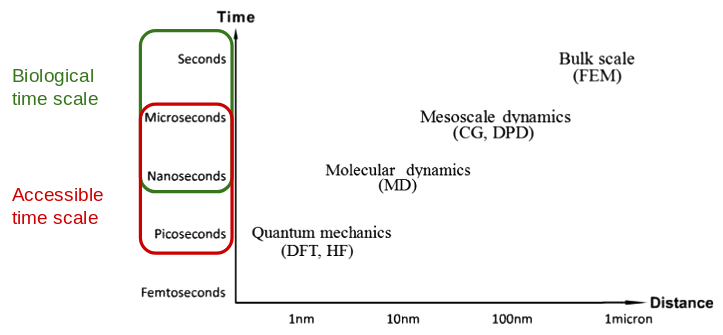
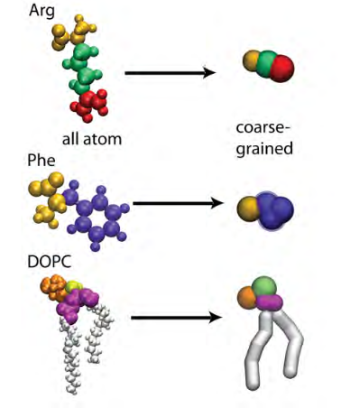

## All-atom simulations

Up to now, we saw a fair range of all-atoms simulations.
Each atom is treated like a point-like particle; if constraints are
used, we can set a 2 fs timestep.

With the help of a nice cluster, we can simulate a biological system
for a reasonable amount of time (hopefully up to microseconds).

Let's remind us the time-scale we are dealing with:

It would be nice to explore larger time scales and bigger systems.
One way to do it is to coarse grain our system.

## Coarse graining
A coarse-grained model is tool to simplify a system and study it
at a lower level of details. Some degrees of freedom are _integrated
out_ and a group of atoms are represented by interaction sites:

$$
\textbf{R}_I = \textbf{M}_I(\textbf{r}) = \sum_i c_{Ii}\textbf{r}_i
$$

where $$\textbf{R}$$ is the CG site, and $$\textbf{M}$$ is the _mapping
function_.

The mapping can use a bottom-up or a top-down approach, can be modelled
on a particular system or can be transferable to others. The definition
of the interactions among sites is non trivial as well.

The aim of this page is not to treat the CG from a theoretical point of view. Several papers and books can be found on this topic[^1].

[^1]: A review by [Noid](https://aip.scitation.org/doi/10.1063/1.4818908) on CG for biomolecular systems.

## Shaken, not stirred
Let's use one of the resources to perform a coarse-grained
simulation: [**MARTINI**](http://cgmartini.nl/).

I know you all like alcohol, but the name is related to a tower in
Groningen, the Martini tower indeed, as an homage to the city in
which this forcefield has been developed.

Martini uses a top-down approach to model the sites (now referred as beads) and their interactions. It is developed to reproduce  structural
or thermodynamical properties, still preserving a chemical specificity
that allow the reproduction of experimental measurable quantities.

Initially, it was intended for lipids, then it was expanded to
proteins. The current version is 2.2, and a version 3.x is
currently in [open beta](http://cgmartini.nl/images/parameters/martini3/beta/martini_3.0.b.3.2.tar.gz).

# 'Philosophy' behind
The Martini ff in based on a **4 to 1** correspondence of atoms to beads.

Here, you can find a schematic representation of how the change in
resolution is performed:

Also water is coarse-grained: **four** water molecules are set to
**one** water bead.

Since the idea behind Martini is to be *system independent*,
the mapping is done on a residue base, so that it is **transferable**.

Each amino acid is represented by <u>one bead for the backbone</u>
and one or more for the sidechains.

Are all the CG residues defined in
this way?

Depending on the sidechains, the beads are divided into four classes:
1. charged: **Q**;
1. polar: **P**;
1. non polar: **N**;
1. apolar: **C**.

These main classes have also subclasses to further differentiate the
residues.

Each bead has 72 or 45 atomic mass units, regardless of the actual
mass of the atoms they represent.

# Force field
In Martini we have bonded interactions:

$$
\begin{align*}
V_b  & = \frac{1}{2} K_b (d_{ij}-d_b)^2\\
V_a  & = \frac{1}{2} K_a \big[\cos(\phi_{ijk})-\cos(\phi_a)\big]^2\\
V_d  & = K_d \big[1+\cos(\theta_{ijkl}-\theta_d)\big]\\
V_{id} & = K_{id} (\theta_{ijkl} - \theta_{id})\\
\end{align*}
$$

Does it have the CHARMm functional form?

For the non-bonded interaction, the Lennard-Jones 12-6 potential is
implemented and the electrostatic interaction with a dielectric
constant of $$\epsilon_{diel} = 15$$.

With the decrease in the number of particles to be simulated it
comes the increase in the timestep that can be used.

As a rule of thumb, the timestep allowed by Martini is between
**20** to **40 fs**. The conservation of the total energy should
be checked for the different time steps (keep in mind that the
  energy conservation depends also on other parameters).

# Application and limitations
The advantage of a CG represention, specifically for Martini,
can be employed to study several problems.
A review of such topics can be found in the 'Further notes' section.

The speed-up in computation and the broader range of systems you could
study are interesting features, but we need to remind ourselves that

<u>From great power it comes greater responsabilities</u>

or, like Ohm's oncle said:

Therefore, limitations are to be taken into account.
We already saw that the backbone of each residue is represented
by a bead.

How would you represent alpha
 helices in this way?

 

You need to enforce the secondary structure.

A more subtle problem is the freezing of water at $$290\pm5 K$$ due
to the LJ 12-6 potential. So we need to add **antifreezing** water
molecules.
Due to this behaviour, systems that present water/air interfaces
cannot be studied.  

## Tutorial
Let's get started with the tutorial.

Go to the TCBG [tutorial page](http://www.ks.uiuc.edu/Training/Tutorials/) and download
the **Residue-based Coarse-graining**.

Once you are ready, put the green sticker on your laptop. **DEMACIAAAAAAAA**

## Further readings
Papers on Martini:
1. [Perspective on the Martini model](https://pubs.rsc.org/en/content/articlelanding/2013/cs/c3cs60093a#!divAbstract)

# Notes
