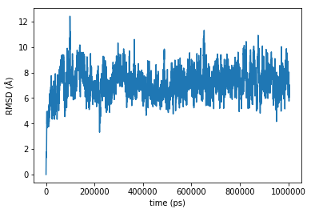
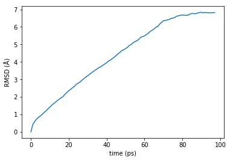
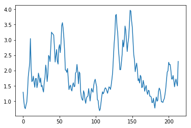
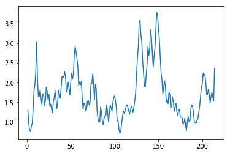
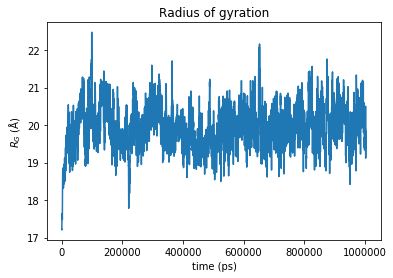
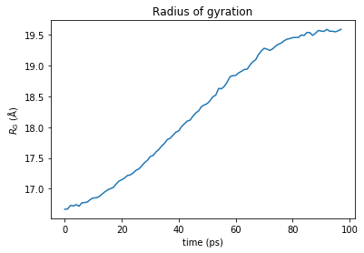
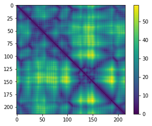
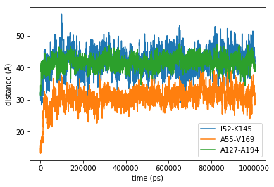
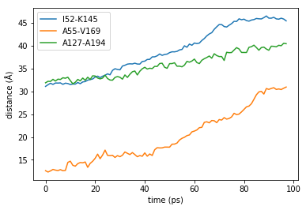

<script src="https://cdnjs.cloudflare.com/ajax/libs/mathjax/2.7.0/MathJax.js?config=TeX-AMS-MML_HTMLorMML" type="text/javascript"></script>

# Introduction

After the simulation is completed, we need to analyse the trajectory.

There is plenty of tools you can use to perform the analysis.

Of course, VMD and `Tcl` scripting with the built-in functions of VMD, almost independent of the file format. Another option is to use Gromacs' analysis tools, which require a specific format of the trajectory.

Today we will use Python as programming language, and the libraries `MDAnalysis` and `prody`. As usual, there are several options in the same Python environment
1. MDtraj
1. PyEmma
1. others...

You can also use `R` and the package `Bio3D`.

Today's tutorial is a mash-up of different tutorial available online.

**CAVEAT**: the terminology will likely be inexact. Let me know if you find any bugs and/or wrong information.

```python
import numpy as np
import matplotlib.pyplot as plt
%matplotlib inline
```

# MDAnalysis

If you are interest in the project, I link [here](https://www.mdanalysis.org/) the link to its website. The package is in development, with stable releases, and you can also contribute via [Github](https://github.com/MDAnalysis/mdanalysis) with issues or pull request.

First of all we need to import the package:


```python
import MDAnalysis as mda
mda.__version__
```


    '0.19.2'


In order to deal with the trajectory, or with a single pdb file, we need to create a `Universe`.
As for VMD, this `Universe` requires a *topology* and a *coordinate* file.

Let's first define the two files and then let's create the `Universe`.
%ls

```python
PSF = 'adk_equilibrium/adk4AKE.psf'
eqDCD = 'adk_equilibrium/1ake_007-nowater-core-dt240ps.dcd'

u = mda.Universe(PSF, eqDCD)
```

What is `u`?


```python
u
```


    <Universe with 3341 atoms>


```python
u.trajectory.n_frames
```


    4187


```python
u.atoms
```


    <AtomGroup with 3341 atoms>


```python
u.atoms.dimensions
```


    array([85.53471, 85.53471, 85.53471, 90.     , 90.     , 90.     ],
          dtype=float32)


## Selecting atoms

It is possible to select only a subset of atoms.


```python
alanines = u.select_atoms('resname ALA')
alanines
```


    <AtomGroup with 190 atoms>


```python
alanines.resids
```


    array([  8,   8,   8,   8,   8,   8,   8,   8,   8,   8,  11,  11,  11,
            11,  11,  11,  11,  11,  11,  11,  17,  17,  17,  17,  17,  17,
            17,  17,  17,  17,  37,  37,  37,  37,  37,  37,  37,  37,  37,
            37,  38,  38,  38,  38,  38,  38,  38,  38,  38,  38,  49,  49,
            49,  49,  49,  49,  49,  49,  49,  49,  55,  55,  55,  55,  55,
            55,  55,  55,  55,  55,  66,  66,  66,  66,  66,  66,  66,  66,
            66,  66,  73,  73,  73,  73,  73,  73,  73,  73,  73,  73,  93,
            93,  93,  93,  93,  93,  93,  93,  93,  93,  95,  95,  95,  95,
            95,  95,  95,  95,  95,  95,  99,  99,  99,  99,  99,  99,  99,
            99,  99,  99, 127, 127, 127, 127, 127, 127, 127, 127, 127, 127,
           176, 176, 176, 176, 176, 176, 176, 176, 176, 176, 186, 186, 186,
           186, 186, 186, 186, 186, 186, 186, 188, 188, 188, 188, 188, 188,
           188, 188, 188, 188, 194, 194, 194, 194, 194, 194, 194, 194, 194,
           194, 203, 203, 203, 203, 203, 203, 203, 203, 203, 203, 207, 207,
           207, 207, 207, 207, 207, 207, 207, 207])


The information stored in the `universe` are numpy array. So you can apply all the modules in numpyu


```python
np.unique(alanines.resids)
```


    array([  8,  11,  17,  37,  38,  49,  55,  66,  73,  93,  95,  99, 127,
           176, 186, 188, 194, 203, 207])


You can also use wildcards in the `select_atoms` string, or use the slicing.


```python
carbons = u.select_atoms('name C*')
carbons.names
```


    array(['CA', 'CB', 'CG', ..., 'C', 'C', 'CA'], dtype=object)


```python
carbons[:10].names
```


    array(['CA', 'CB', 'CG', 'CE', 'C', 'CA', 'CB', 'CG', 'CD', 'CZ'],
          dtype=object)


`carbons` and `carbons[:10]` are Atomgroup.


```python
carbons
```


    <AtomGroup with 1040 atoms>


## RMSD

In order to establish equilibration, the first thing to check is equilibration.

I remind you that the RMSD is defined as
$$RMSD(t) = \sqrt{\frac{\sum_i m_i(\vec{r}_i(t) - \vec{r}_i(t_0))^2}{\sum_i m_i}}$$


```python
u.trajectory.frame
```


    0


### The hard way

We want to compute RMSD. There is a built-in function in `MDAnalysis`, called `rmsd`.


```python
from MDAnalysis.analysis.rms import rmsd
```


```python
PBD_closed = 'adk_equilibrium/adk_closed.pdb'
```


```python
ref = mda.Universe(PSF, PDB_closed)
ref
```


    <Universe with 3341 atoms>


```python
mobile = mda.Universe(PSF, eqDCD)     # we use the first frame
mobile.trajectory.frame
```


    0


Let's compute the rmsd.


```python
rmsd(mobile.select_atoms('name CA').positions, ref.select_atoms('name CA').positions)
```


    29.017277853848036


Let's visualise the two structures in VMD. They do not look so different. Moreover they have the same conformation (closed).

Probably we should investigate better how `rmsd` works.


```python
help(rmsd)
```

    Help on function rmsd in module MDAnalysis.analysis.rms:

    rmsd(a, b, weights=None, center=False, superposition=False)
        Returns RMSD between two coordinate sets `a` and `b`.

        `a` and `b` are arrays of the coordinates of N atoms of shape
        :math:`N times 3` as generated by, e.g.,
        :meth:`MDAnalysis.core.groups.AtomGroup.positions`.

        Note
        ----
        If you use trajectory data from simulations performed under **periodic
        boundary conditions** then you *must make your molecules whole* before
        performing RMSD calculations so that the centers of mass of the mobile and
        reference structure are properly superimposed.


        Parameters
        ----------
        a : array_like
            coordinates to align to `b`
        b : array_like
            coordinates to align to (same shape as `a`)
        weights : array_like (optional)
            1D array with weights, use to compute weighted average
        center : bool (optional)
            subtract center of geometry before calculation. With weights given
            compute weighted average as center.
        superposition : bool (optional)
            perform a rotational and translational superposition with the fast QCP
            algorithm [Theobald2005]_ before calculating the RMSD; implies
            ``center=True``.

        Returns
        -------
        rmsd : float
            RMSD between `a` and `b`

        Notes
        -----
        The RMSD :math:`\rho(t)` as a function of time is calculated as

        .. math::

           \rho(t) = \sqrt{\frac{1}{N} \sum_{i=1}^N w_i \left(\mathbf{x}_i(t)
                                    - \mathbf{x}_i^{\text{ref}}\right)^2}

        It is the Euclidean distance in configuration space of the current
        configuration (possibly after optimal translation and rotation) from a
        reference configuration divided by :math:`1/\sqrt{N}` where :math:`N` is
        the number of coordinates.

        The weights :math:`w_i` are calculated from the input weights
        `weights` :math:`w'_i` as relative to the mean:

        .. math::

           w_i = \frac{w'_i}{\langle w' \rangle}


        Example
        -------
        >>> u = Universe(PSF,DCD)
        >>> bb = u.select_atoms('backbone')
        >>> A = bb.positions.copy()  # coordinates of first frame
        >>> u.trajectory[-1]         # forward to last frame
        >>> B = bb.positions.copy()  # coordinates of last frame
        >>> rmsd(A, B, center=True)
        3.9482355416565049

        .. versionchanged: 0.8.1
           *center* keyword added
        .. versionchanged: 0.14.0
           *superposition* keyword added


```python
# Removing translations
rmsd(mobile.select_atoms('name CA').positions, ref.select_atoms('name CA').positions, center=True)
```


    22.39150433851966


```python
# Removing the rotation
rmsd(mobile.select_atoms('name CA').positions, ref.select_atoms('name CA').positions,
     center=True, superposition=True)
```


    1.8181973717315183


We are usually interested in the RMSD during all the trajectory.

Let's do that!

The **idea** is to loop over the trajectory. The positions of our selection are updated as me move along the trajectory.


```python
mobile_selection = mobile.select_atoms('protein and name CA')
ref_selection = ref.select_atoms('protein and name CA')

for ts in mobile.trajectory[:10]:
    print(ts)
```

    < Timestep 0 with unit cell dimensions [85.53471 85.53471 85.53471 90.      90.      90.     ] >
    < Timestep 1 with unit cell dimensions [85.69929 85.69929 85.69929 90.      90.      90.     ] >
    < Timestep 2 with unit cell dimensions [85.61096 85.61096 85.61096 90.      90.      90.     ] >
    < Timestep 3 with unit cell dimensions [85.58586 85.58586 85.58586 90.      90.      90.     ] >
    < Timestep 4 with unit cell dimensions [85.6257 85.6257 85.6257 90.     90.     90.    ] >
    < Timestep 5 with unit cell dimensions [85.66024 85.66024 85.66024 90.      90.      90.     ] >
    < Timestep 6 with unit cell dimensions [85.61478 85.61478 85.61478 90.      90.      90.     ] >
    < Timestep 7 with unit cell dimensions [85.636696 85.636696 85.636696 90.       90.       90.      ] >
    < Timestep 8 with unit cell dimensions [85.63573 85.63573 85.63573 90.      90.      90.     ] >
    < Timestep 9 with unit cell dimensions [85.621025 85.621025 85.621025 90.       90.       90.      ] >


```python
computedRMSD = []
for ts in mobile.trajectory[:]:
    computedRMSD.append(rmsd(mobile_selection.positions, ref_selection.positions,
                             center=True, superposition=True))
```


```python
plt.plot(computedRMSD);
```


On the `x-axis` we have the indices of the list. Of course we can easily modify the label if we know what is the timestep of the simulation.


```python
mobile.trajectory.dt
```


    240.00000489999024


### The easy way

We can take advantage of more built-in functions in MDAnalysis.


```python
from MDAnalysis.analysis.base import analysis_class

help(analysis_class)
```

    Help on function analysis_class in module MDAnalysis.analysis.base:

    analysis_class(function)
        Transform a function operating on a single frame to an analysis class

        For an usage in a library we recommend the following style:

        >>> def rotation_matrix(mobile, ref):
        >>>     return mda.analysis.align.rotation_matrix(mobile, ref)[0]
        >>> RotationMatrix = analysis_class(rotation_matrix)

        It can also be used as a decorator:

        >>> @analysis_class
        >>> def RotationMatrix(mobile, ref):
        >>>     return mda.analysis.align.rotation_matrix(mobile, ref)[0]

        >>> rot = RotationMatrix(u.trajectory, mobile, ref).run(step=2)
        >>> print(rot.results)


Let's assume we have a function that works only on one frame.


```python
def my_rmsd(mobile_ag, ref_ag):
    '''We always want to align the trajectory to the reference frame. So we set
        center = True
        superposition = True
    '''
    return rmsd(mobile_ag.positions, ref_ag.positions, center=True, superposition=True)
```


```python
my_rmsd
```


    <function __main__.my_rmsd(mobile_ag, ref_ag)>


```python
my_rmsd(mobile_ag=mobile.select_atoms('name CA'), ref_ag=ref.select_atoms('name CA'))
```


    1.8181973717315183


```python
@analysis_class
def my_rmsd(mobile_ag, ref_ag):
    '''We always want to align the trajectory to the reference frame. So we set
        center = True
        superposition = True
    '''
    mobile_pos = mobile_ag.positions
    return rmsd(mobile_pos, ref_ag.positions, center=True, superposition=True)
```


```python
my_rmsd
```


    MDAnalysis.analysis.base.analysis_class.<locals>.WrapperClass


```python
a = my_rmsd(mobile.trajectory, mobile_ag=mobile.select_atoms('name CA'), ref_ag=ref.select_atoms('name CA')).run()
```


```python
plt.plot(a.results)
```


    [<matplotlib.lines.Line2D at 0x7f01b9da0c18>]


This is a nice way to extend a function that works on a frame to the whole trajectory. Of course we can do better, if there is already something that does that for us ;)

### The lazy way


```python
from MDAnalysis.analysis.rms import RMSD
```


```python
help(RMSD)
```

    Help on class RMSD in module MDAnalysis.analysis.rms:

    class RMSD(MDAnalysis.analysis.base.AnalysisBase)
     |  Class to perform RMSD analysis on a trajectory.
     |
     |  The RMSD will be computed for two groups of atoms and all frames in the
     |  trajectory belonging to `atomgroup`. The groups of atoms are obtained by
     |  applying the selection selection `select` to the changing `atomgroup` and
     |  the fixed `reference`.
     |
     |  Note
     |  ----
     |  If you use trajectory data from simulations performed under **periodic
     |  boundary conditions** then you *must make your molecules whole* before
     |  performing RMSD calculations so that the centers of mass of the selected
     |  and reference structure are properly superimposed.
     |
     |
     |  Run the analysis with :meth:`RMSD.run`, which stores the results
     |  in the array :attr:`RMSD.rmsd`.
     |
     |  Method resolution order:
     |      RMSD
     |      MDAnalysis.analysis.base.AnalysisBase
     |      builtins.object
     |
     |  Methods defined here:
     |
     |  __init__(self, atomgroup, reference=None, select='all', groupselections=None, filename='rmsd.dat', weights=None, tol_mass=0.1, ref_frame=0, **kwargs)
     |      Parameters
     |      ----------
     |      atomgroup : AtomGroup or Universe
     |          Group of atoms for which the RMSD is calculated. If a trajectory is
     |          associated with the atoms then the computation iterates over the
     |          trajectory.
     |      reference : AtomGroup or Universe (optional)
     |          Group of reference atoms; if ``None`` then the current frame of
     |          `atomgroup` is used.
     |      select : str or dict or tuple (optional)
     |          The selection to operate on; can be one of:
     |
     |          1. any valid selection string for
     |             :meth:`~MDAnalysis.core.groups.AtomGroup.select_atoms` that
     |             produces identical selections in `atomgroup` and `reference`; or
     |
     |          2. a dictionary ``{'mobile': sel1, 'reference': sel2}`` where *sel1*
     |             and *sel2* are valid selection strings that are applied to
     |             `atomgroup` and `reference` respectively (the
     |             :func:`MDAnalysis.analysis.align.fasta2select` function returns such
     |             a dictionary based on a ClustalW_ or STAMP_ sequence alignment); or
     |
     |          3. a tuple ``(sel1, sel2)``
     |
     |          When using 2. or 3. with *sel1* and *sel2* then these selection strings
     |          are applied to `atomgroup` and `reference` respectively and should
     |          generate *groups of equivalent atoms*.  *sel1* and *sel2* can each also
     |          be a *list of selection strings* to generate a
     |          :class:`~MDAnalysis.core.groups.AtomGroup` with defined atom order as
     |          described under :ref:`ordered-selections-label`).
     |
     |      groupselections : list (optional)
     |          A list of selections as described for `select`, with the difference
     |          that these selections are *always applied to the full universes*,
     |          i.e., ``atomgroup.universe.select_atoms(sel1)`` and
     |          ``reference.universe.select_atoms(sel2)``. Each selection describes
     |          additional RMSDs to be computed *after the structures have been
     |          superimposed* according to `select`. No additional fitting is
     |          performed.The output contains one additional column for each
     |          selection.
     |
     |          .. Note:: Experimental feature. Only limited error checking
     |                    implemented.
     |      filename : str (optional)
     |          write RMSD into file with :meth:`RMSD.save`
     |
     |          .. deprecated:; 0.19.0
     |             `filename` will be removed together with :meth:`save` in 1.0.
     |
     |      weights : {"mass", ``None``} or array_like (optional)
     |           choose weights. With ``"mass"`` uses masses as weights; with ``None``
     |           weigh each atom equally. If a float array of the same length as
     |           `atomgroup` is provided, use each element of the `array_like` as a
     |           weight for the corresponding atom in `atomgroup`.
     |      tol_mass : float (optional)
     |           Reject match if the atomic masses for matched atoms differ by more
     |           than `tol_mass`.
     |      ref_frame : int (optional)
     |           frame index to select frame from `reference`
     |      verbose : bool (optional)
     |           Show detailed progress of the calculation if set to ``True``; the
     |           default is ``False``.
     |
     |      Raises
     |      ------
     |      SelectionError
     |           If the selections from `atomgroup` and `reference` do not match.
     |      TypeError
     |           If `weights` is not of the appropriate type; see also
     |           :func:`MDAnalysis.lib.util.get_weights`
     |      ValueError
     |           If `weights` are not compatible with `atomgroup` (not the same
     |           length) or if it is not a 1D array (see
     |           :func:`MDAnalysis.lib.util.get_weights`).
     |
     |           A :exc:`ValueError` is also raised if `weights` are not compatible
     |           with `groupselections`: only equal weights (``weights=None``) or
     |           mass-weighted (``weights="mass"``) are supported for additional
     |           `groupselections`.
     |
     |      Notes
     |      -----
     |      The root mean square deviation :math:`\rho(t)` of a group of :math:`N`
     |      atoms relative to a reference structure as a function of time is
     |      calculated as
     |
     |      .. math::
     |
     |         \rho(t) = \sqrt{\frac{1}{N} \sum_{i=1}^N w_i \left(\mathbf{x}_i(t)
     |                                  - \mathbf{x}_i^{\text{ref}}\right)^2}
     |
     |      The weights :math:`w_i` are calculated from the input weights `weights`
     |      :math:`w'_i` as relative to the mean of the input weights:
     |
     |      .. math::
     |
     |         w_i = \frac{w'_i}{\langle w' \rangle}
     |
     |      The selected coordinates from `atomgroup` are optimally superimposed
     |      (translation and rotation) on the `reference` coordinates at each time step
     |      as to minimize the RMSD. Douglas Theobald's fast QCP algorithm
     |      [Theobald2005]_ is used for the rotational superposition and to calculate
     |      the RMSD (see :mod:`MDAnalysis.lib.qcprot` for implementation details).
     |
     |      The class runs various checks on the input to ensure that the two atom
     |      groups can be compared. This includes a comparison of atom masses (i.e.,
     |      only the positions of atoms of the same mass will be considered to be
     |      correct for comparison). If masses should not be checked, just set
     |      `tol_mass` to a large value such as 1000.
     |
     |      .. _ClustalW: http://www.clustal.org/
     |      .. _STAMP: http://www.compbio.dundee.ac.uk/manuals/stamp.4.2/
     |
     |
     |      See Also
     |      --------
     |      rmsd
     |
     |
     |      .. versionadded:: 0.7.7
     |      .. versionchanged:: 0.8
     |         `groupselections` added
     |      .. versionchanged:: 0.16.0
     |         Flexible weighting scheme with new `weights` keyword.
     |      .. deprecated:: 0.16.0
     |         Instead of ``mass_weighted=True`` (removal in 0.17.0) use new
     |         ``weights='mass'``; refactored to fit with AnalysisBase API
     |      .. versionchanged:: 0.17.0
     |         removed deprecated `mass_weighted` keyword; `groupselections`
     |         are *not* rotationally superimposed any more.
     |      .. deprecated:: 0.19.0
     |         `filename` will be removed in 1.0
     |
     |  save(*args, **kwds)
     |      `save` is deprecated!
     |
     |      Save RMSD from :attr:`RMSD.rmsd` to text file *filename*.
     |
     |      Parameters
     |      ----------
     |      filename : str (optional)
     |          if no filename is given the default provided to the constructor is
     |          used.
     |
     |
     |
     |
     |
     |      .. deprecated:: 0.19.0
     |         You can instead use ``np.savetxt(filename, RMSD.rmsd)``.
     |         `save` will be removed in release 1.0.0.
     |
     |  ----------------------------------------------------------------------
     |  Methods inherited from MDAnalysis.analysis.base.AnalysisBase:
     |
     |  run(self, start=None, stop=None, step=None, verbose=None)
     |      Perform the calculation
     |
     |      Parameters
     |      ----------
     |      start : int, optional
     |          start frame of analysis
     |      stop : int, optional
     |          stop frame of analysis
     |      step : int, optional
     |          number of frames to skip between each analysed frame
     |      verbose : bool, optional
     |          Turn on verbosity
     |
     |  ----------------------------------------------------------------------
     |  Data descriptors inherited from MDAnalysis.analysis.base.AnalysisBase:
     |
     |  __dict__
     |      dictionary for instance variables (if defined)
     |
     |  __weakref__
     |      list of weak references to the object (if defined)


```python
ca = mobile.select_atoms('protein and name CA')

R = RMSD(ca)
R.run()
```


    <MDAnalysis.analysis.rms.RMSD at 0x7f01b9d9d668>


```python
_, time, ca_rmsd = R.rmsd.T
```


```python
plt.plot(time, ca_rmsd)
plt.xlabel('time (ps)');
plt.ylabel('RMSD (Å)');
ca_rmsd[0]
```


    2.6076733666407134e-07





Compute the RMSD for the following trajectory `neDCD = 'adk_equilibrium/adk_dims.dcd' `


```python
neDCD = 'adk_equilibrium/adk_dims.dcd'
```


```python
u_ne = mda.Universe(PSF, neDCD, in_memory=True)
ca2 = u_ne.select_atoms('protein and name CA')

R2 = RMSD(ca2)
R2.run()
```


    <MDAnalysis.analysis.rms.RMSD at 0x7f01b9d3e780>


```python
_, time, ca_rmsd = R2.rmsd.T
```


```python
plt.plot(time, ca_rmsd)
plt.xlabel('time (ps)');
plt.ylabel('RMSD (Å)');
```





## RMSF

The RMSF is an equilibrium quantity that tells us how a certain atom fluctuates around its average position.

$$RMSF_i = \sqrt{ \langle (r_i - \langle r_i \rangle)^2 \rangle}$$

Of course we have a built-in class.


```python
from MDAnalysis.analysis.rms import RMSF
```


```python
protein_heavy = mobile.select_atoms("protein and name CA")
myRMSF = RMSF(protein_heavy).run()
```


```python
plt.plot(myRMSF.rmsf)
```


    [<matplotlib.lines.Line2D at 0x7f01b30d7198>]





```python
#help(RMSF)
```

We need to align the trajectory to a reference frame. We will use the open conformation.


```python
from MDAnalysis.analysis import align

# Loading the structure
PDB_open = 'adk_equilibrium/adk_open.pdb'
open_uni = mda.Universe(PSF, PDB_open)
```


```python
# Let's define a selection for the equilibrium universe
protein = mobile.select_atoms('protein')

# we PRE-align the structure
prealigner = align.AlignTraj(mobile=mobile, reference=open_uni,
                             select="protein and name CA", in_memory=True).run()

# Creating the reference (average) structure
reference_coordinates = mobile.trajectory.timeseries(asel=protein, start=1000).mean(axis=1)
# make a reference structure (need to reshape into a 1-frame "trajectory")
reference = mda.Merge(protein).load_new(
            reference_coordinates[:, None, :], order="afc")

#order afc is the way it returns the data array: a-tom, f-rame, c-oordinates
```


```python
aligner = align.AlignTraj(u, reference, select="protein and name CA", in_memory=True).run(start=1000)
```


```python
calphas = protein.select_atoms("name CA")
rmsfer = RMSF(calphas, verbose=True).run(start=1000)
```

    Step  3187/3187 [100.0%]


```python
plt.plot(calphas.resids, rmsfer.rmsf)
```


    [<matplotlib.lines.Line2D at 0x7f01ba0dd978>]





Now we want to store the RMSF value in the beta field of a pdb.
We can write the


```python
open_uni.add_TopologyAttr(mda.core.topologyattrs.Tempfactors(np.zeros(len(u.atoms))))
protein = open_uni.select_atoms("protein")
```


```python
len(protein.residues)
len(rmsfer.rmsf)
```


    214


```python
for residue, beta in zip(protein.residues, rmsfer.rmsf):
    residue.atoms.tempfactors = beta
```


```python
protein.write("protein_with_bfactors.pdb")
```

    /home/jarvis/anaconda2/envs/py3/lib/python3.6/site-packages/MDAnalysis/coordinates/PDB.py:902: UserWarning: Found no information for attr: 'altLocs' Using default value of ' '
      "".format(attrname, default))
    /home/jarvis/anaconda2/envs/py3/lib/python3.6/site-packages/MDAnalysis/coordinates/PDB.py:902: UserWarning: Found no information for attr: 'icodes' Using default value of ' '
      "".format(attrname, default))
    /home/jarvis/anaconda2/envs/py3/lib/python3.6/site-packages/MDAnalysis/coordinates/PDB.py:902: UserWarning: Found no information for attr: 'occupancies' Using default value of '1.0'
      "".format(attrname, default))


## Radius of gyration

We already saw the radius of gyration:

$$
R_\mathrm{gyr} = \sqrt{\frac{1}{M}\sum_{i=1}^{N} m_i(\mathbf{r}_i - \mathbf{R})^2}
$$

where $\mathbf{R}$ is the center of mass.


```python
protein = mobile.select_atoms("protein")
```

Let's investigate the methods for the `AtomGroup` `protein`.


```python
rg = []
times = []
for ts in mobile.trajectory:
    rg.append(protein.radius_of_gyration())
    times.append(ts.time)
rg = np.array(rg)
times = np.array(times)
```


```python
plt.plot(times, rg)
plt.title('Radius of gyration')
plt.xlabel("time (ps)")
plt.ylabel(r"$R_G$ (Å)");
```





The radius of gyration behaves like the RMSD, and this is also an hint of how the equilibration can be considered reached.

Do the same for the `ne_universe`.


```python
protein = u_ne.select_atoms("protein")
```

Let's investigate the methods for the `AtomGroup` `protein`.


```python
rg = []
times = []
for ts in u_ne.trajectory:
    rg.append(protein.radius_of_gyration())
    times.append(ts.time)
rg = np.array(rg)
times = np.array(times)
```


```python
plt.plot(times, rg)
plt.title('Radius of gyration')
plt.xlabel("time (ps)")
plt.ylabel(r"$R_G$ (Å)");
```





## Contact map


```python
from MDAnalysis.lib import distances
```


```python
Cα = open_uni.select_atoms('name CA')
```


```python
d_CaCa = distances.distance_array(Cα.positions, Cα.positions)
```


```python
fig, ax = plt.subplots()
img = plt.imshow(d_CaCa)
plt.colorbar(img);
```





## Distances

Experimental FRET labels: distances


* I52 - K145
* A55 - V169
* A127 - A194

Calculate the C$_\beta$ distances as proxies for the spin-label distances.


```python
donors = mobile.select_atoms("name CB").select_atoms("resname ILE and resid 52",
                                           "resname ALA and resid 55",
                                           "resname ALA and resid 127")
```


```python
acceptors = mobile.select_atoms("name CB").select_atoms("resname LYS and resid 145",
                                       "resname VAL and resid 169",
                                       "resname ALA and resid 194")
```


```python
r = donors.positions - acceptors.positions
r
```


    array([[ 20.777103,   7.352953, -23.57818 ],
           [ -8.003485,  -8.776337,  -8.839368],
           [ -9.672781, -28.934841,  -9.881233]], dtype=float32)


```python
d = np.linalg.norm(r, axis=1)
d
```


    array([32.27514 , 14.805887, 32.069088], dtype=float32)


```python
def FRETdist(donors, acceptors):
    return np.linalg.norm(donors.positions - acceptors.positions, axis=1)
```


```python
FRETdist(donors, acceptors)
```


    array([32.27514 , 14.805887, 32.069088], dtype=float32)


```python
distances = []
times = []
for ts in mobile.trajectory:
    d = FRETdist(donors, acceptors)
    distances.append(d)
    times.append(ts.time)
distances = np.array(distances)
times = np.array(times)
```


```python
plt.plot(times, distances)
plt.legend(("I52-K145", "A55-V169", "A127-A194"))
plt.xlabel("time (ps)")
plt.ylabel(r"distance (Å)");
```





For the non-equilibrium trajectory:


```python
donors = u_ne.select_atoms("name CB").select_atoms("resname ILE and resid 52",
                                           "resname ALA and resid 55",
                                           "resname ALA and resid 127")
```


```python
acceptors = u_ne.select_atoms("name CB").select_atoms("resname LYS and resid 145",
                                       "resname VAL and resid 169",
                                       "resname ALA and resid 194")
```


```python
r = donors.positions - acceptors.positions
r
```


    array([[ 18.454721 , -20.825457 ,  13.870202 ],
           [ -5.15199  ,  -7.7556076,  -8.505607 ],
           [-22.466576 , -18.11174  , -13.550823 ]], dtype=float32)


```python
d = np.linalg.norm(r, axis=1)
d
```


    array([31.091139, 12.611019, 31.881138], dtype=float32)


```python
def FRETdist(donors, acceptors):
    return np.linalg.norm(donors.positions - acceptors.positions, axis=1)
```


```python
FRETdist(donors, acceptors)
```


    array([31.091139, 12.611019, 31.881138], dtype=float32)


```python
distances = []
times = []
for ts in u_ne.trajectory:
    d = FRETdist(donors, acceptors)
    distances.append(d)
    times.append(ts.time)
distances = np.array(distances)
times = np.array(times)
```


```python
plt.plot(times, distances)
plt.legend(("I52-K145", "A55-V169", "A127-A194"))
plt.xlabel("time (ps)")
plt.ylabel(r"distance (Å)");
```




