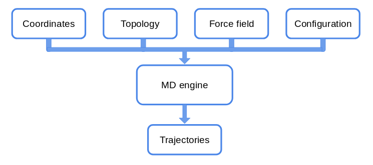
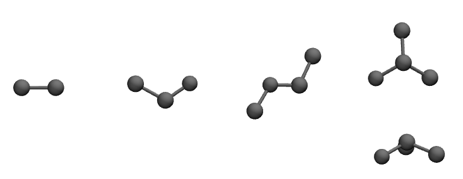
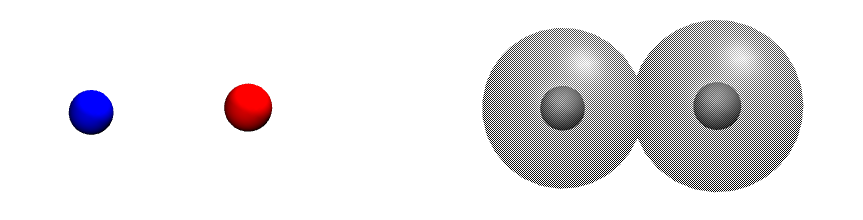
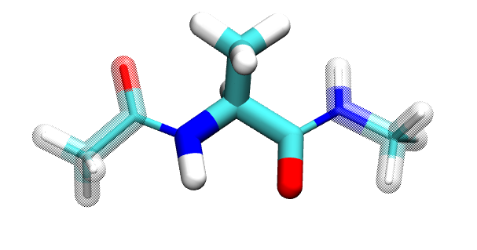
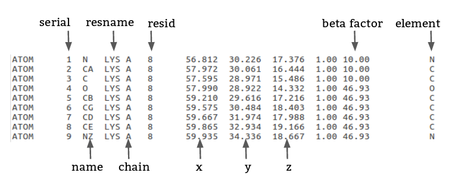

In this session we will introduce the ingredients we need to perform a molecular dynamics simulation.
It is a mesh up of information you can find scattered on different sources. [^1]

[^1]: This tutorial is inspired by
1.  [Using VMD](https://www.ks.uiuc.edu/Training/Tutorials/vmd/vmd-tutorial.pdf)

## Getting ready
For this tutorial, download the following [source file]()**AAAAAAA**.
You should know how to untar, but let's remind it:

$ tar xvzf tutorial2.tar.gz

### Overview
Let's recap the so called **MD machinery**.

In today's tutorial, we will focus on the files that contains the information
on the system we want to study.

## May the Force (field) be with you!

The idea is to solve the Newton's equations of motion for all the atoms in the
system. For each atom in 1D we can write:

$$m\frac{d^2 x}{dt^2} = -\nabla U$$

We need then to know what the potential $$U$$ is. The set of functions and parameters
that composes the $$U$$ is called **Force Field** (**ff** from now on).

The idea behind **ffs** is to mimic the experimental behaviour of proteins with a
potential for atoms that has a
feasible computational cost.
There are several force fields available, such as:
- CHARMm, AMBER for all-atom simulations;
- Martini for coarse grained simulations.

Each ff has its own functional form and its protocol to define parameters. The parameters, in fact, hide under the hood assumptions that make the functional formation viable for simulations. Mixing CHARMm parameters with the AMBER potential,
to mention two of the most popular ffs, will lead you to unreliable results.

Do not mix parameters from different force
fields!

Moreover, ff parameters evolve as more data and simulations are gathered.

Check for the latest version of force fields!

We will mainly use CHARMm ff (version 36)

In general, each force field has two components (we are neglecting the dependence
  on the coordinates and parameters that will be clear in the following):
\$$ U_{ff} = U_{bonded} + U_{non~bonded} $$

Let's have a graphical representation.

 <b>Bonded interactions</b> 

 <b>Non-bonded interactions</b> 

As their name suggest, we can define interactions for covalently bonded atoms as:

$$
\begin{align*}
  U_{bonded} & = \sum_{bonds} \frac{1}{2}k_{bond} (r_{ij} - r_0)^2 \\
      & +  \sum_{angles} \frac{1}{2} k_{angle} (\theta_{ijk} - \theta_{0})^2 \\
   & + \sum_{dihedrals} k_{\phi,n} [\cos(n\phi_{ijkl} +\delta_n) +1]\\
   & + \sum_{impropers} k_{improper} (\chi_{i^{*}jkl} - \chi_0)^2
\end{align*}
$$

but we have also to take into account non-bonded interactions between molecules and
within molecules:

$$
\begin{align*}
  U_{non~bonded} & = \sum_{nb~pairs} \frac{q_i q_j}{4\pi\epsilon_0 r_{ij}}
  + \Big[\frac{A_{ij}}{r_{ij}^{12}} + \frac{B_{ij}}{r_{ij}^6}\Big]\\
\end{align*}
$$

-- plot on gnuplot --

# Alanine dipeptide
Alanine dipeptide is a small peptide usually used to study protein backbone
 dynamics. It consists of an `ALA` in the middle equipped with two minimal peptide bonds. The N terminus _NH2_ gains an acetyl group _CH3CO_, while the the C terminus
 _COOH_ obtains a methylamide _CH3NH_.

 ACE - ALA - NME 

A `pdb` and a `top` file for the alanine dipeptide is provided.
Let's inspect the content of these files.

Use Vim! :)

In the same folder you have also a configuration file called `vacuum.namd`.
It is required to launch **NAMD** and perform the simulation. It is a `Tcl`
script were you can set the parameters of your simulation, the algorithms you want
to use, and the output.
Let's open it as well.

Let's run the simulation! It will take few minutes.

$ namd2 vacuum.namd > ala_vacuum.log &

What does `>` and `&` do?

Try to use the `tail` command:

$ tail -f *.log* 

Use `ctrl-s` to stop the shell screen if it is too fast. To resume the scroll,
use `ctrl-q`.

After the simulation is completed, load with the `Tk console` in _VMD_
the `pdb` and the trajectory.

% mol new dip.top 
mol addfile file.dcd waitfor all

Let's compute the dihedral angles $$\phi$$, whose definition is
$$C_{i-1}-N_{i}-C\alpha_{i}-C_{i}$$, and $$\psi$$, dihedral defined by
$$N_{i}-C\alpha_{i}-C_{i}-N_{i+1}$$.

**Hint**: you `measure`,`4`, _Extension_.

## Coordinates: PDB
We have already see a `pdb` file few moments ago.

Let's go the [Protein Data Bank website](https://www.rcsb.org/) and search for the
structure `4pti`.

Move the `pdb` file from `~/Download/` into `QCB_course/bpti/`.

Let's open it (with ViM!). For sake of safety, use:

$ vim -R 4pti.pdb

Let's search the keyword we already know. Type in the Vim_ `Normal mode`:
`/ATOMS ` (note the white space after the `S`).

`ATOMS`, `HETATM` define the rows in which atoms are written. The first is used
for the atoms of the proteins, ligands and water atoms are defined by the latter.

Let go at the beginning of the file (`gg` in _ViM_).
There are a lot of information, most of the are experimental data.
They are characterised by the keywords in the first column.
Some of them will be explained in the next lessons.
Now, go to the first `SEQRES` (search within _ViM_).

Let's focus on the `SSBOND` keyword. In this section, if present, disulfide bonds
are defined.
These are bonds between the sulfur `S` atoms of two close cysteins.
Disulfide bonds play an important role in the folding and stability of some proteins,
therefore you have to include them in your future structure.

Load the pdb with _VMD_, and remove the water from the visualisation.

Visualise the disulfide bridges.

Does VMD create a link between 2 close sulfur atoms?

Let's write a new pdb without the water.

% set prot [atomselect top "protein"] 
$prot writepdb only_bpti.pdb

You should have successfully create a new `pdb` file.

**NB**: Usually the water molecules in a `pdb` can play an important role in the
protein biological function. In general, it is a good practice to keep them in
your final system.

## Topology: .psf and .top in CHARMm
Let's download the latest version of the [CHARMm ff](mackerell.umaryland.edu/charmm_ff.shtml)
and extract it into our `QCB_course/` folder.

From now on, we will use _topology_ for referring to the `top_*` files of the
force field, and _structure_ for the `psf` file.

 <b>Topology file</b>: a collection of bricks.
<b>PSF file</b>: a subset of the top file arranged in a particular fashion.

The idea is to use the `top` file to construct the `psf` of our system.

# Top
Analogia con le costruzioni/lego.
pdb ti dice dove mettere
top ti dice come li puoi mettere
psf ti dice come li hai messi

What is a pdb
- protein data Bank
- definition = coordinates
- REMARKS of lysozime/bpti
- protonation state (pKa [^2]) / disulfite bond

[^2]: what is pka
- missing atoms/residues

top file keyword:
`RESI`
`PRES`

# what is a psf
Each segment of the system not covalently bound to others must have a separate
psf file.

creazione del pdb/psf together - lysozyme 'or' myoglobin:

da soli : bpti

####### recap

pdb ok

psf - info su struttura e cariche parziali =>
dove stanno ste cariche > forma del potenziale

inoltre il file top contiene:
- internal coordinates
- cmap
- nbfix

---

1) recap of the problem - how to perform a simulation

2) ff intro with functional form and equations

// break dialanine (see pdb - psf) and play with it
-- run 50 ns
-- alignment for visualisation of trajectory
-- ramachandran plot (phi psi angles definition)

3) pdb from PDBank (choose structure)- analysis of REMARKS (Theoretical)
(what kind of remarks we need )
4) psf (theoretical) / .top (for gromacs) itp

5) top (theoretical + open top file --- Download charmm36)
what cmap is
// creation of the psf file of btpi/lysozyme
  -- what minimising the structure means
// test launch in vacuum (minimisation) -- see bonvin

6) parameter files

bpti - case study from ks.uiuc; small; disu;
