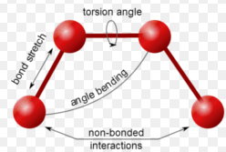

In this session we will introduce the ingredients we need to performa a molecular dynamics simulation.
It is a mesh up of information you can find scattered on different sources. [^1]

[^1]: This tutorial is inspired by
1.  [Using VMD](https://www.ks.uiuc.edu/Training/Tutorials/vmd/vmd-tutorial.pdf)

### Overview
Let's recap the so called **MD machinery**.

## Amagabula magicabula bibidi-bobidi-bu
The idea is to solve the Newton's equations of motion for all the atoms in the
system. For each atom in 1D we can write:

$$m\frac{d^2 x}{dt^2} = -\nabla U$$

We need then to know what the potential $$U$$ is. The set of functions and parameters
that composes the $$U$$ is called **Force Field** (**ff** from now on).

The idea behind **ffs** is to mimic the experimental behaviour of proteins with a
potential for atoms that has a
feasible computational cost.
There are several force fields available, such as:
- CHARMm, AMBER for all-atom simulations;
- Martini for coarse grained simulations.

Each ff has its own functional form and its protocol to define parameters. The parameters, in fact, hide under the hood assumptions that make the functional formation viable for simulations. Mixing CHARMm parameters with the AMBER potential,
to mention two of the most popular ffs, will lead you to unreliable results.

Do not mix parameters from different force
fields!

Moreover, ff parameters evolve as more data and simulations are gathered.

Check for the latest version of force fields!

We will mainly use CHARMm ff (version 36)

In general, each force field has two components:
$$ U_{ff} = U_{bonded} + U_{non~bonded} $$

As the pedices suggest,

$$
\begin{align*}
  U_{bonded} & = \sum k_{bond} (r - r_0)^2 \\
   & + lol \\
  & \phi(x,y) = \phi \left(\sum_{i=1}^n x_ie_i, \sum_{j=1}^n y_je_j \right)
  = \sum_{i=1}^n \sum_{j=1}^n x_i y_j \phi(e_i, e_j) = \\
  & (x_1, \ldots, x_n) \left( \begin{array}{ccc}
      \phi(e_1, e_1) & \cdots & \phi(e_1, e_n) \\
      \vdots & \ddots & \vdots \\
      \phi(e_n, e_1) & \cdots & \phi(e_n, e_n)
    \end{array} \right)
  \left( \begin{array}{c}
      y_1 \\
      \vdots \\
      y_n
    \end{array} \right)
\end{align*}
$$
// U(\{x_i\}) = U_{bonded}(\{x_i\}; \{k_j\}) + U_{non bonded}(\{x_i\}; \{q_j, lj_k\}) //

---

    

        $$

\begin{left*}
  U_{bonded} & = \sum k_{bond} (r - r_0)^2 \\
   & + lol \\
\end{left*}
        $$

            

    

        $$

\begin{align*}
  U_{bonded} & = \sum k_{bond} (r - r_0)^2 \\
   & + lol \\
\end{align*}
        $$

        ###something else here
    

---

# How ff are made of
the same substance of the dreams
**Bunch of equation for the force field**

# alanine with not CHARMM36.

from alanine (**pic**) => alanine dipeptide (**pic**)

// probably not - creazione dialanina (sia modding pdb che usando ALA + N-C-term)

**DIALANINE pic**

N Term - C term

sneakpeak to the parameter files for dialanine

Open PDB - PSF ( DEMO )

Compute the dihedral angles

## PDB PSF TOP files
Analogia con le costruzioni/lego.
pdb ti dice dove mettere
top ti dice come li puoi mettere
psf ti dice come li hai messi

What is a pdb
- protein data Bank
- definition = coordinates
- REMARKS of lysozime/bpti
- protonation state (pKa [^2]) / disulfite bond

[^2]: what is pka
- missing atoms/residues

top file keyword:
`RESI`
`PRES`

# what is a psf
Each segment of the system not covalently bound to others must have a separate
psf file.

creazione del pdb/psf together - lysozyme 'or' myoglobin:

da soli : bpti

####### recap

pdb ok

psf - info su struttura e cariche parziali =>
dove stanno ste cariche > forma del potenziale

inoltre il file top contiene:
- internal coordinates
- cmap
- nbfix

---

1) recap of the problem - how to perform a simulation

2) ff intro with functional form and equations

// break dialanine (see pdb - psf) and play with it
-- run 50 ns
-- alignment for visualisation of trajectory
-- ramachandran plot (phi psi angles definition)

3) pdb from PDBank (choose structure)- analysis of REMARKS (Theoretical)
(what kind of remarks we need )
4) psf (theoretical) / .top (for gromacs) itp

5) top (theoretical + open top file --- Download charmm36)
what cmap is
// creation of the psf file of btpi/lysozyme
  -- what minimising the structure means
// test launch in vacuum (minimisation) -- see bonvin

6) parameter files

bpti - case study from ks.uiuc; small; disu;
